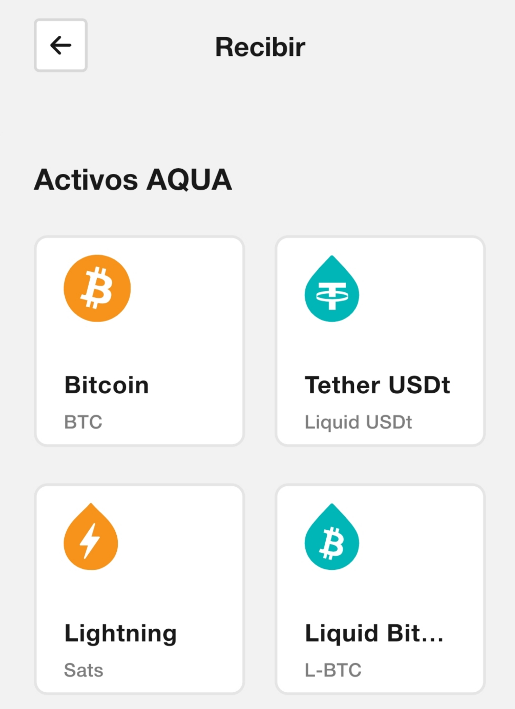
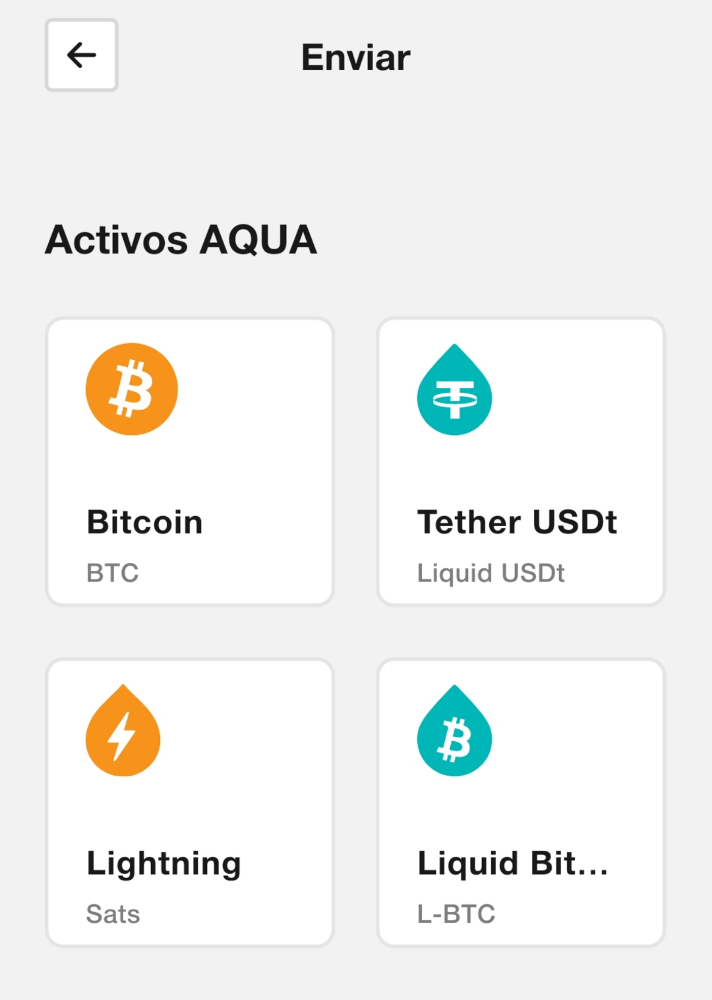

# Guía de uso de AQUA Wallet

---

## Índice

- [Introducción](#introducción)
- [Recibir fondos](#recibir-fondos)
- [Enviar fondos](#enviar-fondos)
- [Mercado](#mercado)
- [Conclusión](#conclusión)
- [Recomendaciones](#recomendaciones)
- [BTCLNAT](#btclnat)

---

## Introducción

AQUA Wallet es una aplicación móvil desarrollada por el equipo de [JAN3](https://jan3.com) que permite gestionar Bitcoin y activos digitales sobre la red Liquid de forma sencilla e intuitiva. Está disponible para Android y iOS, y está especialmente pensada para usuarios que buscan rapidez, bajo costo y una experiencia fluida sin complicaciones técnicas. Gracias a su integración con la red Lightning, múltiples cadenas para USDT, y el uso de swaps automáticos hacia Liquid, AQUA facilita recibir y enviar fondos de manera eficiente, incluso para quienes se están iniciando en el uso de criptomonedas. Su interfaz clara y su enfoque en la usabilidad convierten a AQUA en una excelente alternativa para pagos cotidianos, remesas y ahorro digital.

---

## Recibir fondos

Al seleccionar **RECIBIR**, podrás escoger entre varias opciones de activos:

- **Bitcoin on-chain** (BTC)
- **Tokens de la red Liquid** como L-BTC, L-USDT y otros
- **Bitcoin Lightning**
- **USDT en las cadenas Ethereum, Tron, BSC y Polygon**

En los casos de Lightning y USDT en estas cadenas, AQUA realiza un **swap automático**:

- Los fondos recibidos por Lightning se convierten en **L-BTC**.
- Los USDT recibidos en Ethereum, Tron, BSC o Polygon se convierten en **L-USDT**.

---

## Enviar fondos

Al presionar **ENVIAR**, puedes seleccionar el activo y la red de destino:

- **BTC on-chain**
- **Tokens de la red Liquid** como L-BTC, L-USDT y otros
- **Bitcoin Lightning**
- **USDT en las cadenas Ethereum, Tron, BSC y Polygon**

Cuando envías por Lightning o en las cadenas mencionadas, AQUA realiza un **swap desde tu saldo en Liquid**:

- El envío por Lightning se hace a partir de **L-BTC**.
- El envío de USDT en Ethereum, Tron, BSC o Polygon se hace a partir de tu saldo en **L-USDT**.

---

## Mercado

En la barra inferior central encontrarás el botón **Mercado**, que te da acceso a tres funciones:

- **Comprar BTC** directamente desde la app.
- **Intercambio P2P** de activos con otros usuarios.
- **BTC Map**, donde puedes localizar negocios que aceptan Bitcoin en tu zona.

---

## Conclusión

AQUA Wallet es una solución práctica, eficiente y segura para enviar, recibir y almacenar Bitcoin y USDT en diferentes redes, con una experiencia de usuario simplificada. Gracias a su enfoque en la red Liquid, logra ofrecer transacciones rápidas y económicas, ideales para pagos cotidianos y remesas.

---

## Recomendaciones

AQUA Wallet y la red Liquid tienen muchas ventajas, pero no son adecuadas en todos los contextos. Considera las siguientes recomendaciones:

### No usar AQUA Wallet si:

- ❌ Necesitas **control absoluto sobre tu semilla** para restaurarla en otras wallets. AQUA no permite exportar la semilla a otras aplicaciones.
- ❌ Requieres **interoperabilidad completa con otras billeteras Liquid** como Blockstream Green o Marina Wallet. AQUA está más cerrada al ecosistema JAN3.
- ❌ Deseas operar con **hardware wallets**. AQUA está limitada a dispositivos móviles.

### Casos donde sí brilla AQUA:

- ✅ Usuarios nuevos que buscan facilidad de uso y bajo costo.
- ✅ Personas que necesitan mover fondos rápidamente entre redes (Lightning ↔ Liquid ↔ Ethereum/Tron/BSC/Polygon).
- ✅ Situaciones donde las comisiones altas de Bitcoin on-chain hacen inviables los pagos pequeños.

---

### BTCLNAT

Sígueme en X: [https://x.com/delgadoamaran](https://x.com/delgadoamaran)  
Sígueme en Stackers News: [https://stacker.news/BTCLNAT](https://stacker.news/BTCLNAT)  

Sígueme en Nostr:
- npub1dhttjg8sjk4arx0qywsu9s7c09sxagrz5kktvsl78dfqwy9er
- BTCLN@btcpay.cubabitcoin.org

Regálame un cafecito con Lightning Network: btclnat@lnbits.cubabitcoin.org
