# Aqua Wallet para Cuba

1. [Introducción](#1-introducción)  
1.1. [¿Qué es Aqua Wallet?](#11-qué-es-aqua-wallet)  
1.2. [¿Por qué usar Aqua Wallet en Cuba?](#12-por-qué-usar-aqua-wallet-en-cuba)  
2. [Crear una billetera con Aqua Wallet](#2-crear-una-billetera-con-aqua-wallet)  
2.1. [Interfaz en Aqua Wallet](#21-interfaz-en-aqua-wallet)  
3. [Usando Aqua Wallet](#3-usando-aqua-wallet)  
3.1. [Recibir](#31-recibir)  
3.2. [Enviar](#32-enviar)  
3.3. [Escanear](#33-escanear)  
4. [Accediendo a Aqua Wallet desde Cuba](#4-accediendo-a-aqua-wallet-desde-cuba)  
4.1. [¿Existen restricciones de acceso?](#41-existen-restricciones-de-acceso)  
4.2. [¿Es necesario usar VPN?](#42-es-necesario-usar-vpn)  
5. [Ventajas y Desventajas de Aqua Wallet](#5-ventajas-y-desventajas-de-aqua-wallet)  
5.1. [Ventajas](#51-ventajas)  
5.2. [Desventajas](#52-desventajas)  
6. [¿Cómo puedes ayudar a la comunidad?](#6-cómo-puedes-ayudar-a-la-comunidad)  
7. [Conclusión](#7-conclusión)

## 1 Introducción

### 1.1 ¿Qué es Aqua Wallet?

[Aqua Wallet](https://aqua.net/) es una billetera **autocustodia** creada por la compañía [JAN3](https://jan3.com), que permite almacenar, enviar y recibir **Bitcoin (BTC)** tanto en la cadena principal como en la **Red Liquid**, además de **Lightning**, y **tokens estables** como **L-USDT** y **DePix**. Está diseñada para ser fácil de usar, rápida y segura, sin comprometer la privacidad ni requerir conocimientos técnicos avanzados.

La Red Liquid procesa transacciones aproximadamente cada **1 minuto**, y basta con **2 confirmaciones** para que los fondos estén disponibles, lo cual se traduce en una experiencia fluida, especialmente útil para pagos y remesas.

Además de Bitcoin, AQUA permite gestionar otros activos como **USDT en Liquid (L-USDT)**, que mantiene paridad 1:1 con el dólar estadounidense, y **DePix**, una moneda estable en Liquid con paridad al real brasileño. Estos tokens permiten mantener valor sin exponerse a la volatilidad de BTC y ofrecen **transacciones confidenciales**, una capa adicional de privacidad que protege al usuario.

AQUA también integra **Lightning Network** sin necesidad de abrir canales, gracias a una tecnología que usa **intercambios automáticos (submarine swaps)** a través de **Boltz**, facilitando la interoperabilidad entre Lightning y Liquid sin complicaciones para el usuario.

Por si fuera poco, AQUA admite **USDT en múltiples redes**: ERC20, TRC20, BSC, Polygon y Solana. Al recibir desde estas redes, se realiza automáticamente un **swap** para convertirlo en L-USDT dentro de AQUA. Lo mismo ocurre al enviar: se parte desde fondos en L-USDT y se extrae hacia esas redes.

**Servicios de intercambio**

AQUA utiliza los siguientes servicios de intercambio:

* **SideSwap**: Permite intercambios entre tokens en la red Liquid (L-BTC, L-USDT, DePix)  
* **Boltz Exchange**: Realiza los swaps entre la red Lightning y la red Liquid (submarine swaps)  
* **Peg-in y Peg-out**: permiten mover fondos entre Bitcoin Onchain y Liquid (BTC <-> L-BTC)  

**Nota importante:** Los intercambios dentro de AQUA pueden tener mínimos y máximos que varían, así como tarifas específicas según la red usada. Es recomendable revisar la sección de tarifas y swap antes de hacer operaciones:  
[https://jan3.zendesk.com/hc/en-us](https://jan3.zendesk.com/hc/en-us)

Además, al ser software de código abierto, permite a cualquier comunidad personalizarla según sus necesidades.

### 1.2 ¿Por qué usar Aqua Wallet en Cuba?

La comunidad Cuba Bitcoin ha tenido que enfrentarse a constantes barreras en su camino hacia la adopción de Bitcoin. Múltiples herramientas y servicios se ven restringidos debido a las sanciones impuestas al pueblo cubano ([Más información aquí](https://github.com/cuban-opensourcers/cuban-restricted)), lo que dificulta el acceso a la tecnología. Además, muchas plataformas requieren procesos KYC, y debido a las sanciones de la OFAC y las fuertes restricciones económicas, los cubanos son constantemente excluidos del sistema financiero internacional.

En el ámbito de Bitcoin, varias billeteras han bloqueado directa o indirectamente a los usuarios cubanos. Aqua Wallet no bloquea directamente, pero requiere el uso de VPN dentro de Cuba para poder acceder a sus servicios.

Cuba Bitcoin siempre ha apostado por soluciones de autocustodia siguiendo el principio maximalista:

> “No tus llaves, no tus monedas”

Sin embargo, estas soluciones pueden crear una fricción inicial para nuevos usuarios, debido principalmente a la poca capacidad de fondos para poder abrir canales y pagar comisiones de red, que en ocasiones pueden ser altas para el salario promedio en Cuba (menos de 15 USD al mes). Por eso, Aqua surge como una solución en este entorno por las siguientes características:

* **Privacidad sin complicaciones**: transacciones confidenciales sin tener que configurar nada  
* **Velocidad real**: Liquid confirma en 2 minutos, Lightning es instantáneo, y AQUA permite moverse entre ambas  
* **Sin necesidad de abrir canales**: AQUA gestiona Lightning automáticamente  
* **Soporte para monedas estables**: útil para quienes quieren evitar la volatilidad del BTC  
* **Acceso global**: puedes recibir USDT desde ERC20, TRC20, BSC, Polygon o Solana  
* **Ideal para remesas**: desde Brasil, EE. UU. u otros países  
* **Fácil de usar con VPN**: aunque requiere VPN en Cuba, el uso no se ve afectado y los fondos están siempre disponibles  

## 2 Crear una billetera con Aqua Wallet

1. Dirígete a: [https://aqua.net/](https://aqua.net/)

  
  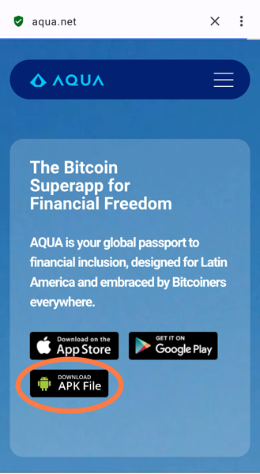  

2. Descarga la aplicación desde uno de los enlaces (recomendamos usar Download APK FILE) descarga directa desde GitHub.

3. Una vez descargada e instalada (usar VPN si estás en Cuba) debes crear una nueva billetera.

  
  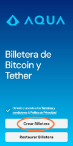  

4. Después de creada debes dirigirte al botón de Ajustes.

  
  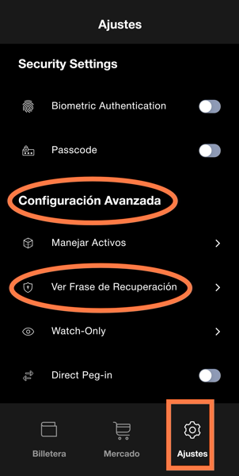  

5. Desplázate hasta Configuración Avanzada → Ver Frase de Recuperación.

  
  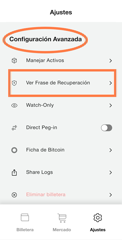  

6. En la pantalla See Phrase click en Next para que se muestren las 12 palabras que debes **ANOTAR y GUARDAR**.

  
  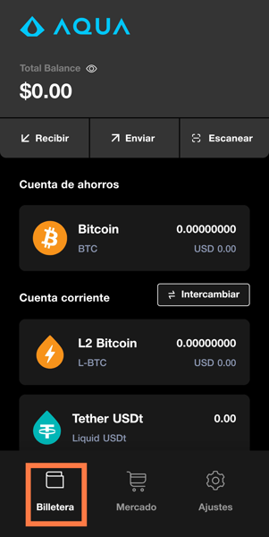  

7. ¡Listo! Ya tienes tu Billetera Aqua Creada.

## 2.1 Interfaz en Aqua Wallet

Vamos a desglosar las partes visibles de la interfaz de Aqua:

**1. Menú Billetera**

Aquí se encuentran las opciones principales de gestión de la billetera:

- **Precio de Bitcoin/Total del balance** → Se modifica al tocar sobre el elemento  
- **Recibir** → Muestra los activos que se pueden recibir (tanto activos Aqua como USDT de ETH, Tron, BSC, Solana y Polygon).  
- **Enviar** → Muestra los activos que se pueden enviar (tanto activos Aqua como USDT de ETH, Tron, BSC, Solana y Polygon).  
- **Escanear** → Esta opción permite escanear tanto código QR como factura de texto y automáticamente detecta el activo y la cadena.  
- **Pantalla central** → Muestra una Cuenta de Ahorros (Bitcoin Onchain) y la Cuenta Corriente (Activos Aqua).

  
  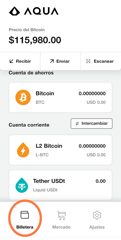  

**2. Menú Mercado**

Como indica su nombre aquí se gestionan las opciones de Mercado:

Después de escoger la Región tendrás acceso a las opciones provistas para la misma:

- **Comprar Bitcoin:** dependiendo de la región se puede realizar la compra o venta de Bitcoin mediante tarjetas de crédito o débito.  
- **Intercambios:** en esta sección se realizan intercambios entre los activos Liquid y Bitcoin.  
- **BTC Map:** muestra los negocios que aceptan Bitcoin en todo el mundo que están registrados en el mapa.  
- **Dolphin Card:** tarjeta Visa recargable con Bitcoin o Liquid sin KYC (tiene restricciones geográficas).  
- **My First Bitcoin:** acceso al libro de texto del diplomado Mi Primer Bitcoin en diferentes idiomas.

  
  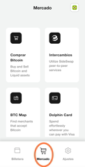  

**3. Menú Ajustes**

Aquí se muestran las opciones de ajustes de la billetera:

**Cuenta JAN3:** necesaria para acceder a diferentes ofertas de la empresa como la Dolphin Card. Se utiliza un email para el registro y nada más.

**Configuración General:**  
- **Idioma:** seleccionar el idioma con el que se va a trabajar en la billetera.  
- **Moneda de Referencia:** seleccionar la moneda que se mostrará como referencia del valor de Bitcoin y la fuente de rate.  
- **Región:** seleccionar la región desde la cual estás operando con la billetera.  
- **Themes:** seleccionar el tema visual de la billetera.  
- **Explorador de Bloques preferido:** seleccionar entre blockstream.info o mempool.space.  
- **Consigue Ayuda:** seleccionar entre soporte y preguntas frecuentes.

  
  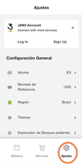  

**Configuración de Seguridad:**  
Se definen dos opciones:

- **Autenticación Biométrica:** mediante huella.  
- **Passcode:** para utilizar esta opción debes introducir la Frase de Recuperación. De olvidar el Passcode, debes introducir la Frase de Recuperación para desbloquear la billetera.

  
  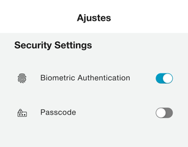  

**Configuración Avanzada:**  
- **Manejar Activos:** puedes añadir activos Liquid que están disponibles en la billetera.  
- **Ver Frase de Recuperación:** si no lo hiciste al principio o perdiste la copia, aquí puedes volver a verla.  
- **Watch-Only:** puedes exportar tu llave pública (Bitcoin o Liquid) a otra billetera compatible para tener una billetera solo mirar.  
- **Direct Peg-in:** si se activa esta opción todos los depósitos onchain se convertirán a L-BTC automáticamente.  
- **Ficha Bitcoin:** mecanismo de lectura mediante el cual se importan fondos en Bitcoin a partir de una ficha física que contiene algún código.  
- **Share Logs:** exporta un archivo .txt con los procesos de la billetera para análisis en caso de error.  
- **Eliminar billetera:** elimina la billetera completamente.

  
  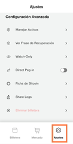  

## 3 Usando Aqua Wallet

### 3.1 Recibir

En este apartado podremos recibir Bitcoin en capa 1 (onchain), activos Liquid, Lightning Network y USDT en cinco cadenas diferentes.

  
  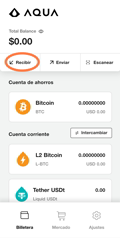  

En el caso de Bitcoin Onchain será en direcciones Legacy. Se recibe en capa 1 si no está activado el Peg-in automático, de lo contrario se hace swap directo a L-BTC.

  
  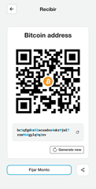  

Los activos Liquid incluyen fundamentalmente L-BTC (1:1 con Bitcoin) y L-USDT (1:1 con el USD). En Brasil también se utiliza DePix (1:1 con el BRL). Existen además otros activos vinculados al Peso Mexicano, Euro y Yen Japonés.

  
  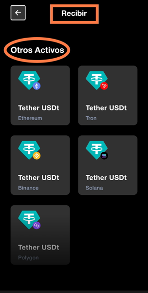  

En el caso de recibir por Lightning Network, se genera una factura Lightning. Aqua no utiliza Lightning Address, por lo que el pago se enruta mediante Boltz y los fondos se reciben como L-BTC.

Aqua también permite recibir USDT desde cinco cadenas: Ethereum (ERC20), Tron (TRC20), BSC, Polygon y Solana. Los fondos son automáticamente convertidos a USDT-Liquid, que no puede ser bloqueado por protocolo. Actualmente el proveedor del swap es automático, pero se planea permitir selección manual.

  
  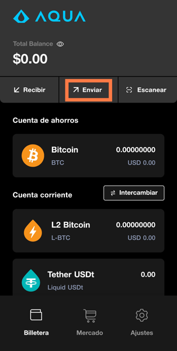  

### 3.2 Enviar

Podrás enviar Bitcoin Onchain, activos Liquid, Bitcoin en Lightning Network y USDT en las mismas cinco cadenas mencionadas.

  
  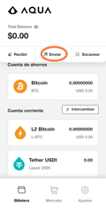  

Para Bitcoin Onchain se puede enviar directamente desde la "Cuenta de Ahorros" y hacer Peg-out desde L-BTC.

  
    

Los activos Liquid pueden enviarse a otras billeteras compatibles (Blockstream Green, otra Aqua Wallet, CoinOS enviando L-BTC) o realizar intercambios entre ellos.

  
  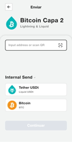  

  
  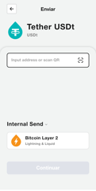  

  
  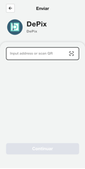  

El envío por Lightning se realiza pagando una factura Lightning desde el saldo de L-BTC mediante un swap inverso, con una comisión base de 50 satoshis, más fees de swap y enrutamiento.

  
  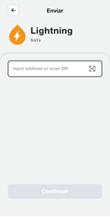  

Los envíos de USDT en las distintas cadenas se hacen desde el saldo de USDT-Liquid, pagando las tarifas correspondientes.

  
  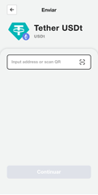  

  
  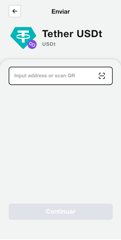  

  
  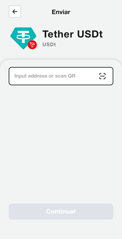  

  
  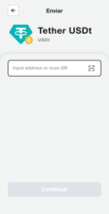  

  
  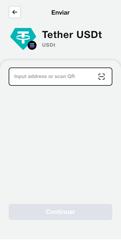  

### 3.3 Escanear

La opción de escanear permite leer códigos QR o facturas en texto y la billetera detecta automáticamente el activo y la cadena para enviar.

  
  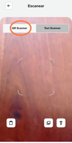  

  
  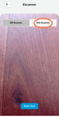  

## 4 Accediendo a Aqua Wallet desde Cuba

### 4.1 ¿Existen restricciones de acceso?

En **Cuba**, el acceso a servicios internacionales puede verse afectado por limitaciones en la infraestructura de internet. Sin embargo, la billetera puede ser utilizada como una alternativa para cobrar, gastar y usar **Bitcoin** de forma sencilla, rápida y con bajas comisiones dentro del entorno cubano.

### 4.2 ¿Es necesario usar VPN?

Sí, es estrictamente necesario usar **VPN** para acceder a la billetera. Además, el uso de VPN es una buena práctica en términos de privacidad y seguridad.

## 5 Ventajas y Desventajas de Aqua Wallet

### 5.1 Ventajas

- **Fácil de usar:** No se requiere conocimiento técnico avanzado. Solo es necesario instalar la aplicación para comenzar a recibir y enviar pagos.  
- **Autocustodia:** Tienes control total sobre tus fondos. Sin embargo, debes cuidar muy bien tu frase de recuperación.  
- **Monedas estables:** Permite usar USDT y DePix, lo que ayuda a evitar la volatilidad de Bitcoin. Al estar en Liquid, los fondos no pueden ser bloqueados por protocolo.  
- **Rápido y privado:** Ideal cuando la red de Bitcoin está congestionada. Liquid ofrece confirmaciones rápidas y transacciones confidenciales.  
- **Tarjeta Visa sin KYC:** Dolphin Card permite realizar pagos tradicionales recargándola con BTC o activos en Liquid.

### 5.2 Desventajas

- **Liquid es una cadena federada:** Al usar L-BTC, estás confiando tus bitcoins a una federación. No tienes control total como en Bitcoin onchain.  
- **No admite Lightning Address:** Aunque se puede recibir y enviar por Lightning, se hace mediante swaps. Esto añade tarifas adicionales y puede demorar un poco más.  
- **No es compatible con Hardware Wallets:** No puedes utilizar Aqua junto a billeteras frías para almacenamiento más seguro.

## 6 ¿Cómo puedes ayudar a la comunidad?

El presente tutorial forma parte del programa educativo de la comunidad **Cuba Bitcoin**. Puedes contribuir de diversas maneras para fortalecer el uso de **Bitcoin** y **Lightning Network** en el país:

- **Participación en educación y difusión:** Comparte tus conocimientos, organiza talleres, charlas o clases. La educación es clave para la adopción.  
- **Creación de contenido:** Genera recursos educativos claros y accesibles.  
- **Actividades comunitarias:** Participa en meetups, encuentros y actividades locales.  
- **Apoyo en redes sociales:** Síguenos y apóyanos en redes para ampliar el alcance del trabajo educativo.

### Redes Sociales

- **X:** [Cuba_BTC](https://twitter.com/Cuba_BTC)  
- **Nostr:**  
  - **NPUB:** `npub1huyn6ru55pv6l7p0sxvlu3vfpq7pan958sl4weft0kte6lvdvvksd5s34t`  
  - **NIP05:** `cubabitcoin@btcpay.cubabitcoin.org`

## 7 Conclusión

AQUA Wallet es una solución práctica, eficiente y segura para enviar, recibir y almacenar Bitcoin y USDT en diferentes redes, ofreciendo una experiencia de usuario sencilla y accesible. Gracias a su enfoque en la Red Liquid, permite realizar transacciones rápidas y económicas, ideales para pagos cotidianos y remesas.

Aunque Aqua Wallet es una herramienta de autocustodia, es importante recordar que utiliza Liquid, una red federada que no es la cadena principal de Bitcoin. Cuando dispongas de suficientes fondos para abrir canales Lightning, se recomienda hacerlo hacia nodos confiables como el nodo de Cuba Bitcoin o cualquier otro nodo de tu preferencia.

Si cuentas con el conocimiento, recursos e infraestructura, considera también la posibilidad de operar tu propio nodo para maximizar la autonomía y seguridad de tus fondos. La comunidad está siempre disponible para apoyarte en este proceso.

**El objetivo final siempre debe ser: ser dueño de tu propio dinero.**  
Aqua Wallet es un puente útil para avanzar hacia esa meta.

  
    

---

**Autor: BTCLNAT**

- Sígueme en X: [https://x.com/delgadoamaran](https://x.com/delgadoamaran)  
- Sígueme en Nostr:  
  - npub: `npub1dhttjg8sjk4arx0qywsu9s7c09sxagrz5kktvsl78dfqwy9er`  
  - NIP05: `BTCLN@btcpay.cubabitcoin.org`

☕ **Regálame un cafecito con Lightning Network:**  
`btclnat@lnbits.cubabitcoin.org`

  
    

