# BTCPay Server en Cuba Bitcoin

1. [Introducción](#1-introducción)  
1.1 [¿Qué es BTCPay Server?](#11-qué-es-btcpay-server)  
1.2 [Historia y contexto](#12-historia-y-contexto)  
1.3 [Resumen sobre la iniciativa de la comunidad Cuba Bitcoin](#13-resumen-sobre-la-iniciativa-de-la-comunidad-cuba-bitcoin)  
2. [Creación de cuenta en BTCPay Server](#2-creación-de-cuenta-en-btcpay-server)  
2.1 [Registro](#21-registro)  
2.2 [Configuración inicial de la tienda](#22-configuración-inicial-de-la-tienda)  
3. [Integraciones con wallets](#3-integraciones-con-wallets)  
3.1 [Usar BTCPay Server con LNbits de Cuba Bitcoin](#31-usar-btcpay-server-con-lnbits-de-cuba-bitcoin)  
4. [Creación de una tienda con BTCPay Server](#4-creación-de-una-tienda-con-btcpay-server)  
4.1 [Configuración inicial y opciones de personalización](#41-configuración-inicial-y-opciones-de-personalización)  
4.2 [Opciones adicionales de pago](#42-opciones-adicionales-de-pago)  
4.3 [Formulario personalizado](#43-formulario-personalizado)  
4.4 [Roles](#44---roles)  
4.5 [Crowfund](#45---crowdfund)  
5. [Accediendo al servidor desde Cuba](#5---accediendo-al-servidor-desde-cuba)  
5.1 [¿Existen restricciones de acceso?](#51---existen-restricciones-de-acceso)  
5.2 [¿Es necesario usar VPN o Tor?](#52---es-necesario-usar-vpn-o-tor)  
6. [¿Cómo puedes ayudar a la comunidad?](#6-cómo-puedes-ayudar-a-la-comunidad)  
6.1 [Donaciones para sostener el servidor](#61-donaciones-para-sostener-el-servicio)  
6.2 [Reporte de errores y mejoras en la plataforma](#62-reporte-de-errores-y-sugerencias-de-mejora-en-la-plataforma)  
6.3 [Participación en la educación y difusión sobre Bitcoin en Cuba](#63-participación-en-la-educación-y-difusión-sobre-bitcoin-en-cuba)  
7. [Conclusión](#7---conclusión)  
7.1 [Próximos pasos y cómo BTCPay Server puede seguir evolucionando en la comunidad](#71---próximos-pasos-y-cómo-btcpay-server-puede-seguir-evolucionando-en-la-comunidad)  

## 1. Introducción

En este capítulo, explicaremos qué es BTCPay Server, cómo surgió y el contexto detrás de esta herramienta.

### 1.1 ¿Qué es BTCPay Server?

BTCPay Server es un procesador de pagos de código abierto y autoalojado que permite a comerciantes, desarrolladores y organizaciones aceptar pagos en Bitcoin sin depender de terceros y sin incurrir en tarifas adicionales.

### 1.2 Historia y contexto

Fue creado en 2017 por Nicolas Dorier, un desarrollador de Bitcoin, en respuesta a una decisión polémica de BitPay, el principal procesador de pagos en Bitcoin en ese momento.

En 2017, BitPay anunció que dejaría de soportar pagos que no usaran BIP-70, un protocolo de pago que generaba preocupaciones en la comunidad por problemas de privacidad y descentralización. Muchos usuarios de Bitcoin, incluidos desarrolladores y comerciantes, rechazaban la implementación de BIP-70 debido a que requería compartir información personal y complicaba la experiencia de pago.

Como respuesta, Nicolas Dorier escribió en Twitter (actual X):

> **"Eso es mentira, mi confianza en ti está rota. Te haré obsoleto"**

Con esa motivación, comenzó a desarrollar BTCPay Server como una alternativa completamente descentralizada y de código abierto. En poco tiempo, el proyecto ganó el apoyo de la comunidad de Bitcoin y se convirtió en la solución preferida para procesar pagos.

**Post original:** [https://x.com/NicolasDorier/status/898378514256207872](https://x.com/NicolasDorier/status/898378514256207872)

### 1.3 Resumen sobre la iniciativa de la comunidad Cuba Bitcoin

Cuba enfrenta un panorama económico complejo, caracterizado por una fuerte devaluación monetaria, la ausencia de soluciones de pago eficientes y un comercio electrónico en crecimiento pero con múltiples dificultades. La infraestructura bancaria nacional está marcada por la burocracia y la obsolescencia tecnológica, lo que dificulta aún más la integración de pagos digitales.

Además, debido al bloqueo financiero y las restricciones impuestas por la OFAC, muchas plataformas internacionales han restringido o cerrado el acceso a cubanos, dejando a emprendedores y comerciantes con muy pocas opciones para recibir pagos desde el exterior.

Ante este contexto, BTCPay Server es la alternativa ideal, ya que permite recibir pagos en Bitcoin de manera directa, sin intermediarios, y sin riesgo de censura. Sin embargo, la implementación de un servidor propio suele ser un reto para pequeños y medianos comerciantes, e incluso para empresas más grandes.

Para aceptar pagos en Lightning Network usando BTCPay, es necesario operar un nodo Lightning, lo que implica gestionar liquidez, abrir canales y asumir costos por comisiones, una barrera difícil de superar en un país donde el salario promedio es menor a $10 USD al mes. Además, mantener un BTCPay Server requiere un nodo de Bitcoin Core, infraestructura técnica y el pago de servidores, lo que está fuera del alcance de la mayoría de los comerciantes cubanos.

Para solucionar este problema, **Cuba Bitcoin** ha desplegado un servicio de BTCPay Server, eliminando estas barreras y permitiendo que cualquier persona pueda montar su propia tienda en línea y empezar a aceptar pagos en Bitcoin, sin necesidad de contar con recursos o conocimientos técnicos o financieros avanzados.

Esta iniciativa busca impulsar el comercio electrónico y la adopción de Bitcoin en la isla, brindando una herramienta accesible y sin censura para comerciantes, emprendedores y ciudadanos que buscan una alternativa financiera soberana.

## 2. Creación de cuenta en BTCPay Server

Este capítulo te guiará paso a paso en el proceso de crear tu cuenta en BTCPay Server, desde el registro inicial hasta la configuración básica de tu tienda.

### 2.1 Registro

Para comenzar a recibir pagos en Bitcoin con BTCPay Server, primero necesitas crear una cuenta en la instancia de **Cuba Bitcoin**. Este proceso es rápido y sencillo:

1. Dirígete al sitio web del servidor BTCPay Server de Cuba Bitcoin:  
   [https://btcpay.cubabitcoin.org](https://btcpay.cubabitcoin.org)
2. En la página principal, haz clic en **Registrarse** o **Sign Up**.

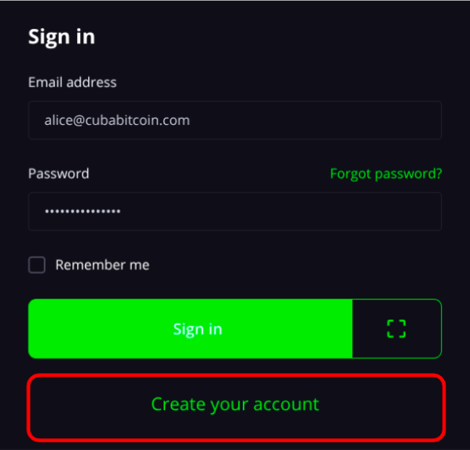

3. Completa los campos solicitados:
   - **Correo electrónico** (se usará para gestionar tu cuenta).
   - **Contraseña segura** (elige una fuerte y guárdala en un lugar seguro).
4. Haz clic en **Create your account**.
5. Revisa tu bandeja de entrada y busca el correo de confirmación de BTCPay Server. Si no lo ves, revisa la carpeta de spam.
6. Haz clic en el enlace de confirmación para activar tu cuenta.

¡Listo! Ya tienes tu cuenta en BTCPay Server. Ahora puedes iniciar sesión y empezar a configurar tu tienda.

### 2.2 Configuración inicial de la tienda

Una vez que has creado tu cuenta en BTCPay Server, el siguiente paso es configurar tu tienda:

1. Inicia sesión en el servidor de BTCPay Server de Cuba Bitcoin.
2. En el panel principal, haz clic en **Create Store**.
3. Elige un **nombre para tu tienda**. Puede ser el nombre de tu negocio o cualquier identificador que prefieras.
4. Selecciona la **moneda fiat de referencia**.  
   BTCPay Server permite trabajar con distintas monedas. En el caso de Cuba, se encuentra la opción de **CUP (peso cubano)** para calcular precios en moneda local.
5. Configura el **origen del precio**.  
   La opción más recomendada para Cuba es **Yadio**, ya que ofrece una tasa de cambio actualizada y confiable para el contexto cubano.
6. Haz clic en **Create Store** para guardar la configuración inicial.

Tu tienda ha sido creada.

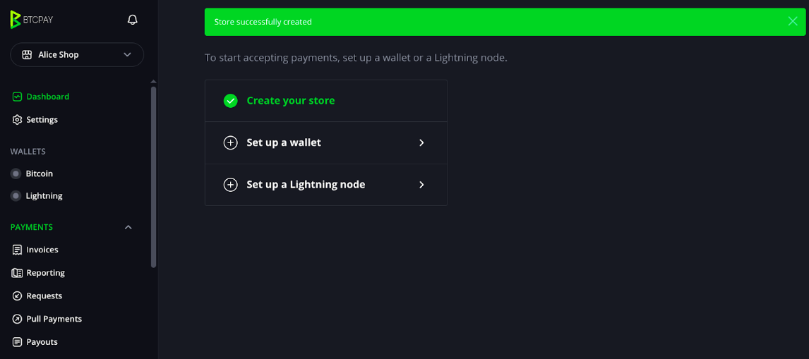

**Opciones de precios**

Si prefieres gestionar los precios de tus productos en **USD**, puedes seleccionar esta configuración.

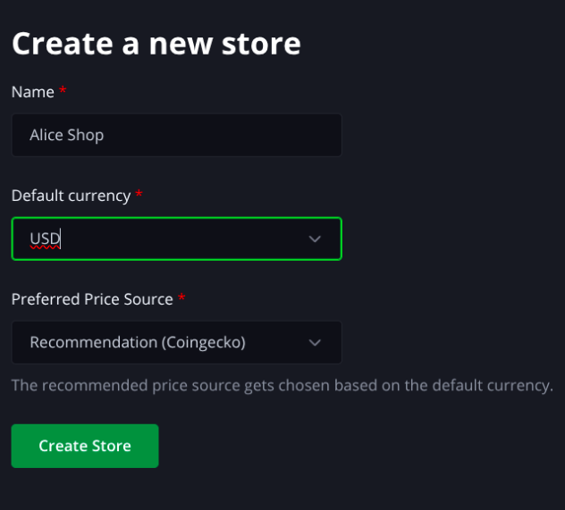

Si deseas establecer los precios en **CUP**, te recomendamos esta opción para mayor precisión en el contexto cubano.

Ahora que tu tienda está configurada, en los siguientes capítulos aprenderás a integrar métodos de pago y recibirlos en Bitcoin y Lightning Network.

## 3. Integraciones con wallets

En este capítulo, aprenderás cómo integrar BTCPay Server con diferentes wallets para facilitar el proceso de pagos y recibir Bitcoin de manera eficiente. 

Aunque BTCPay Server permite vincular tu tienda con muchas opciones, las soluciones propuestas aquí están pensadas para el contexto de **Cuba**, donde acceder a herramientas financieras puede ser un desafío. Sin embargo, estos métodos también pueden ser útiles en otros países.

### 3.1 Usar BTCPay Server con LNbits de Cuba Bitcoin

Para empezar a aceptar pagos en tu tienda, es necesario configurar una wallet o conectarte a un nodo de Lightning.

La comunidad **Cuba Bitcoin** ofrece una instancia de [**LNbits**](https://lnbits.cubabitcoin.org)  
donde puedes recibir pagos fácilmente a través de Lightning Network y conectarlo a tu tienda en BTCPay Server.

Si tienes dudas sobre cómo crear tu cuenta en LNbits, puedes consultar el siguiente tutorial: [https://cuba-bitcoin.github.io/tutoriales/lnbits.html](https://cuba-bitcoin.github.io/tutoriales/lnbits.html)  

Si ya dominas el proceso, sigamos adelante.

Una vez que hayas ingresado a tu cuenta en **LNbits**, dirígete a la sección de **Extensions** y activa **LndHub**.

Una vez en **LndHub**, selecciona la billetera en la que recibirás los pagos y haz clic en **COPY LNDHUB ADMIN URL** para copiar el contenido.

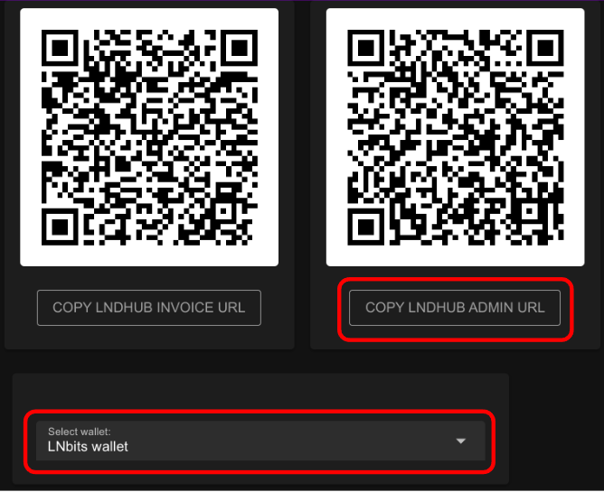

Regresa a **BTCPay Server** y, en el **Dashboard**, selecciona **Set up a Lightning node** para comenzar la configuración.

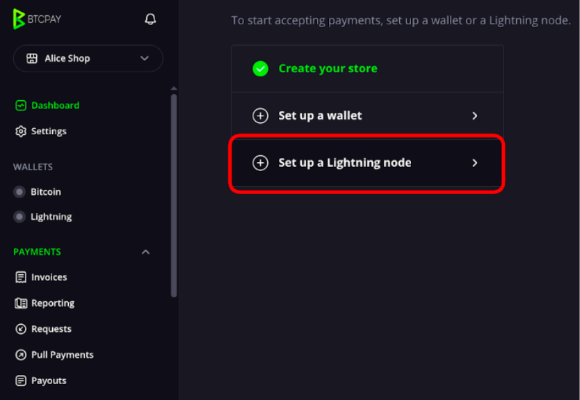

Pega el contenido que copiaste de la extensión **LndHub** en el campo debajo de **Connection configuration for your custom Lightning node**.

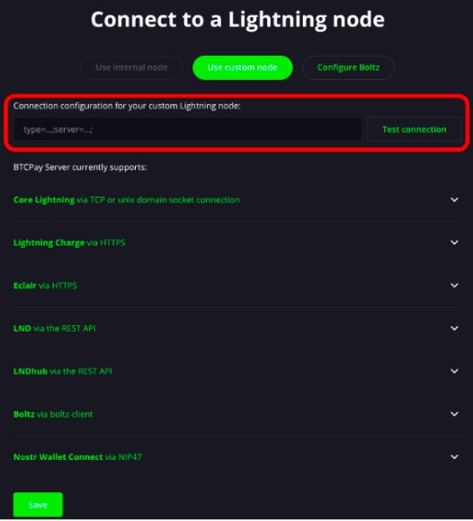

Selecciona **Test connection** y, si ves el mensaje **"Connection to the Lightning node successful..."**, significa que la conexión se ha realizado correctamente.

Selecciona **Save** en la esquina inferior y tienes la tienda lista y configurada para recibir pagos.

En la instancia de BTCPay Server de **Cuba Bitcoin**, tienes la libertad de elegir el método de integración que mejor se adapte a tus necesidades. Usar [**LNbits**](https://lnbits.cubabitcoin.org) de Cuba Bitcoin te ofrece una opción enfocada en las necesidades de la comunidad, pero siempre es recomendable explorar y hacer tu propia investigación para encontrar lo que mejor funcione para ti.

## 4. Creación de una tienda con BTCPay Server

Este capítulo guiará a los usuarios en el proceso de crear una tienda en BTCPay Server, desde la configuración inicial hasta la gestión de pagos.

### 4.1 Configuración inicial y opciones de personalización

1. En el menú lateral izquierdo, selecciona **PLUGINS** y luego elige la opción **Point of Sale (Punto de Venta)**.
2. Verás la opción **Create a new Point of Sale**.
   - En **AppName**, ingresa el nombre que desees para tu tienda.  
   Por ejemplo: `Alice Shop Havana`.
   - Haz clic en **Create** para crear tu Punto de Venta.

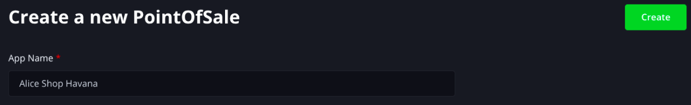

Una vez creado, deberías ver algo similar a la siguiente pantalla.

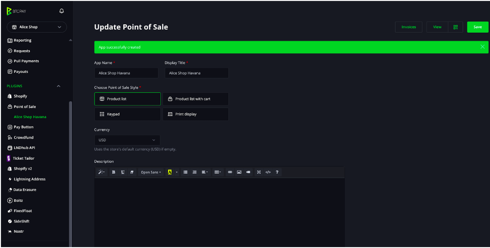

3. Verás la opción **Choose Point of Sale**.  
   Para este ejemplo, seleccionaremos **Product list with card**, aunque puedes cambiar esto más adelante según tus preferencias.

4. En el campo **Description**, puedes agregar una breve descripción de tu tienda o de los productos ofrecidos.  
   Esto es útil para compartir información adicional con los clientes (opcional).

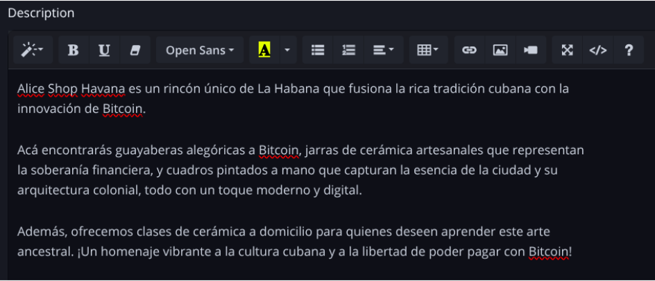

**Gestión del inventario**

- En **Update Point of Sale**, puedes gestionar el inventario de tu tienda.
- Por defecto, BTCPay Server incluye un inventario de ejemplo (como una tienda de té).

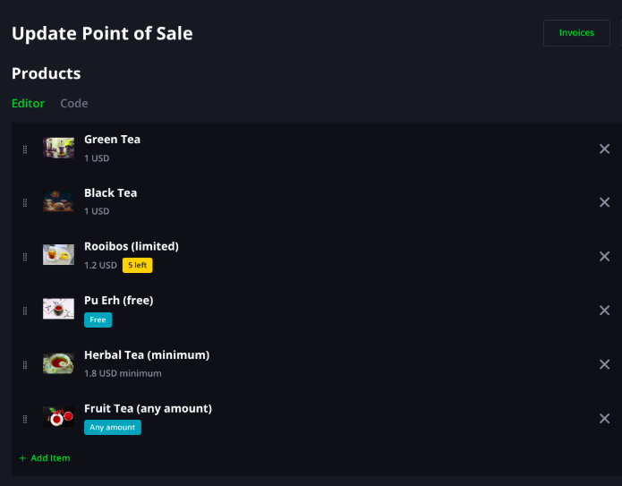

Se puede **agregar**, **editar** o **eliminar** productos:

Para **eliminar** un producto: haz clic en la **X** al lado del producto.

Para **agregar** un producto nuevo: haz clic en **Add item**.

**Al agregar un producto, encontrarás los siguientes campos:**

- **Title**: Nombre del producto.
- **ID**: Si lo dejas en blanco, se generará automáticamente desde el título.
- **Precio**:
  - `Fixed`: el cliente debe pagar exactamente ese monto.
  - `Custom`: el cliente elige cuánto pagar (ideal para donaciones).
  - `Minimum`: monto mínimo aceptado en modo Custom.
- **Imagen**: Puedes subir una imagen del producto (usa **Upload**).
- **Descripción**: Detalles adicionales del producto.
- **Categorías**: Agrupa los productos por categoría.
- **Inventario**: Deja en blanco para no gestionarlo. Si lo llenas, puedes controlar cantidades disponibles.
- **Texto del botón de compra**: Personaliza con mensajes como “Comprar ahora”, “Donar”, etc.
- **Habilitar/Deshabilitar**: Controla si el producto está visible o no en tu tienda.

Ejemplo:
- Producto: **Guayabera con el logo de Bitcoin**
- Categoría: `Ropa`
- Precio: `10 USD`
- Inventario: `20 unidades`

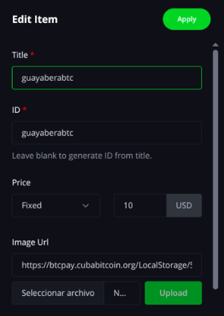
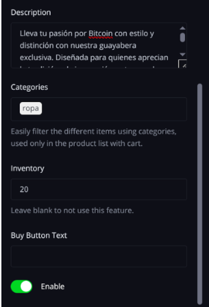

Cuando termines de agregar un producto, haz clic en **Apply**.

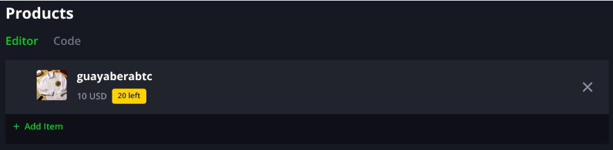

Puedes seguir agregando más productos o servicios. Cuando termines, selecciona **Save** para guardar el estado de tu tienda.

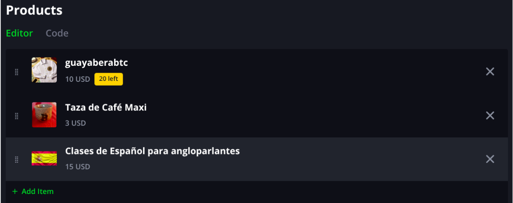

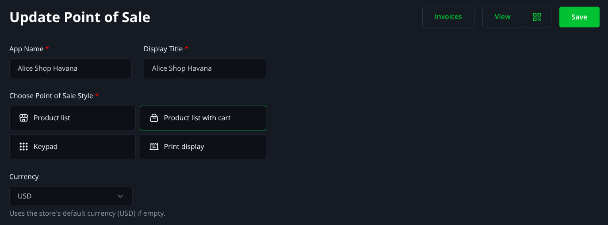

**Solicitar datos de envío**

Si tu tienda ofrece envíos a domicilio, puedes pedir los datos del destinatario.

1. En la pestaña **Checkout**, busca la opción  
   **Request customer data on checkout**.
2. Selecciona **Request shipping address**.
3. Haz clic en **Save** (en la parte superior).

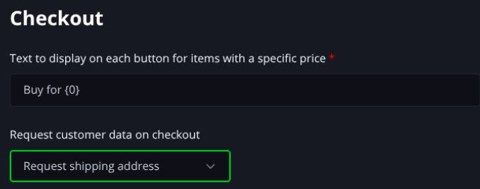  

**Visualizar tu tienda**

Haz clic en **View** para ver cómo luce tu tienda.

  

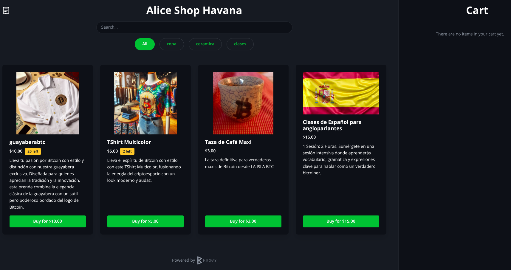  

**Realizar una compra**

1. Selecciona los artículos que deseas comprar.  
   Por ejemplo:
   - Taza de Café Maxi de **LA ISLA BTC**
   - T Shirt Multicolor

  

2. Haz clic en **Pay** para procesar el pago.

3. Si seleccionaste previamente solicitar datos de envío, verás un formulario a completar.

4. Realiza el pago usando **Bitcoin Lightning** y ¡listo!

¡Has hecho tu primera venta en BTCPay Server!

Puedes acceder a la tienda creada por el siguiente enlace:

[https://btcpay.cubabitcoin.org/apps/2nSap9K8BsJ1xhGWnktf29F8pUyB/pos](https://btcpay.cubabitcoin.org/apps/2nSap9K8BsJ1xhGWnktf29F8pUyB/pos)

**NO VAYAS A COMPRAR NADA — SOLO TIENE CARÁCTER EDUCATIVO**

### 4.2 Opciones adicionales de pago

Una vez que tengas tu tienda lista, es probable que algún cliente prefiera pagarte con esa "shitcoin" que está de moda, impulsada por el último youtuber, el presidente de los Estados Unidos o incluso Elon Musk, en lugar de usar el mejor dinero del mundo.

Como buen vendedor, tú podrás ofrecer lo que desea sin necesidad de involucrarte directamente con esa criptomoneda. ¿Cómo lo lograrás? Vamos a verlo:

1. Ve al menú **PLUGINS** y selecciona **FixedFloat**.

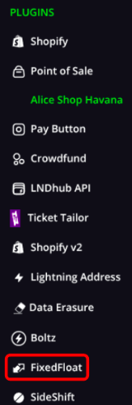

2. Activa la opción **Enable**.

3. Haz clic en **Save** para guardar los cambios.

Ahora, al momento de pagar en tu tienda, los clientes verán dos opciones:

- Pagar directamente con una **invoice de Lightning**.
- Usar la nueva alternativa **FixedFloat**.

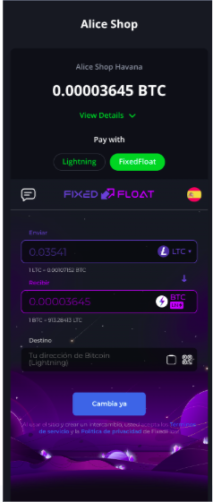

El proceso es simple:
Nos dirigimos a la tienda, elegimos los productos que queremos y, al momento de pagar, nos encontramos con dos opciones: pagar directamente con una invoice de Lightning o usar la nueva alternativa Fixed Float.
Solo copiamos la invoice a pagar, elegimos la shitcoin en la que queremos enviar, y listo. Así de fácil, estamos aceptando pagos en cualquier cripto, mientras seguimos recibiendo el mejor dinero del mundo: Bitcoin.

### 4.3 Formulario personalizado

Si los formularios predeterminados no se ajustan a lo que necesitas, no te preocupes.  
**BTCPay** te permite crear y personalizar tu propio formulario. Aquí te explicamos cómo:

1. Ve a **Settings**.
2. Selecciona la pestaña **Form**.

3. Haz clic en **Create Form** para diseñarlo a tu gusto.

**Al agregar un campo al formulario, debes definir:**

- **Type**: el tipo de dato (texto, número, contraseña, email, etc.).
- **Label**: el nombre visible que verá el cliente en el formulario.
- **Name**: el nombre interno que usarás para identificar ese campo.
- **Required field**: puedes marcarlo para que sea obligatorio.

Puedes añadir todos los campos que necesites, personalizando el formulario según las necesidades específicas de tu tienda.

**Vincular tu formulario a la tienda**

1. Una vez guardado el formulario, ve a **Point of Sale**.
2. Selecciona la tienda a la que deseas agregar el formulario.
3. En la sección **Checkout**, selecciona el nombre de tu formulario personalizado.

Tu tienda ahora cuenta con un formulario hecho a la medida.

### 4.4 - Roles

En BTCPay Server, los roles son permisos asignados a diferentes usuarios que determinan qué acciones pueden realizar dentro de la plataforma. Cada rol tiene acceso a funciones específicas de la tienda y el servidor. Los roles permiten administrar de manera eficiente quién puede modificar configuraciones, gestionar pagos, ver información sensible, y más.  
En BTCPay Server, los roles por defecto son Owner, Manager, Employee y Guest tienen diferentes niveles de acceso y permisos dentro de la plataforma. Aquí te explico lo que puede hacer cada uno:

**Owner (Propietario):**
- Tiene control total sobre la tienda y la configuración del servidor.
- Puede modificar todos los ajustes de la tienda, incluidas las configuraciones globales.
- Puede ver, modificar y eliminar facturas, pagos, solicitudes y configuraciones.

**Manager (Gerente):**
- Tiene acceso para gestionar la tienda, pero con permisos más limitados que el propietario.
- Puede ver y modificar facturas, solicitudes de pago, webhooks, pagos y configuraciones específicas de la tienda.
- No tiene acceso completo a las configuraciones del servidor ni la posibilidad de realizar cambios a nivel global.

**Employee (Empleado):**
- Permisos más restrictivos.
- Puede visualizar y modificar facturas, solicitudes de pago y pagos, pero no puede realizar cambios críticos en la tienda.
- No tiene acceso a configuraciones globales o ajustes de la tienda en su totalidad.

**Guest (Invitado):**
- Este rol tiene permisos muy limitados, generalmente solo para ver información pública.
- No puede realizar cambios en la tienda ni ver información sensible como pagos o facturas.
- Ideal para usuarios que solo necesitan acceso para visualizar la tienda sin permisos de gestión.

Para ver los detalles de los roles en BTCPay Server, debes dirigirte a Settings y luego seleccionar Roles. Allí podrás ver los roles que tienes por defecto. Además, si necesitas personalizar los permisos, tienes la opción de Add Role, que te permite crear un rol nuevo y asignarle los permisos que consideres necesarios según las necesidades de tu tienda.

Para añadir roles de usuario en BTCPay Server, debes ir a Settings y luego al apartado de Users. Allí verás la opción de añadir el correo electrónico de tu empleado y asignarle el rol correspondiente. Al hacerlo, podrás darle el nivel de acceso adecuado según el rol que se le asigna, ya sea Owner, Manager, Employee u otro rol personalizado que hayas creado. Esto facilita la gestión de permisos y asegura que cada usuario tenga el acceso necesario para su función dentro de la tienda.

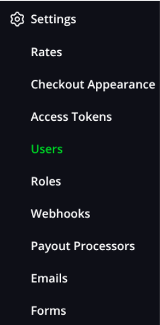

### 4.5 - Crowdfund

Un Crowdfund (o crowdfunding) es un método de financiamiento colectivo en el que varias personas contribuyen económicamente a un proyecto, empresa, causa o producto a través de pequeñas aportaciones. Este método es muy usado para lanzar nuevos productos, apoyar causas sociales, financiar startups y proyectos creativos.

En BTCPay podemos crear nuestra propia campaña. Solo debemos dirigirnos al apartado de  
**PLUGINS** y seleccionar **Crowdfund**.

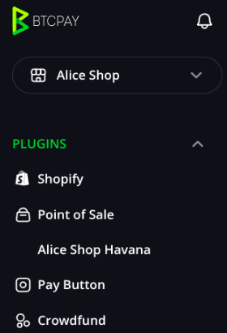

En la sección **"Create a New Crowdfund"**, debemos ingresar el nombre de nuestro proyecto. Para este ejemplo, crearemos un crowdfund para un proyecto de protección animal llamado **"Un Hogar para Cada Huella"**.

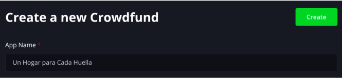

Una vez creado, debemos completar los datos requeridos. **Display Title** es el título que se mostrará en la página, mientras que **Tagline** es el lema del proyecto. También podemos añadir una imagen representativa del proyecto. Además, tenemos la opción de hacer que el crowdfund sea público.

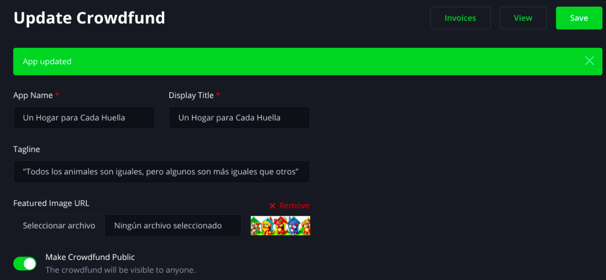

Podemos añadir una descripción a nuestro proyecto en **Description**, en la cual detallamos su propósito, los objetivos que buscamos alcanzar y el impacto que tendrá. Es importante que la descripción sea clara, inspiradora y transmita a los potenciales donantes por qué su apoyo es fundamental.

Podemos añadir **Perks** en nuestro crowdfund. Estos son una recompensa o beneficio para los donantes, como una forma de agradecer su apoyo y motivarlos a contribuir. Los perks pueden incluir productos exclusivos, menciones especiales, experiencias o cualquier incentivo relacionado con el proyecto.

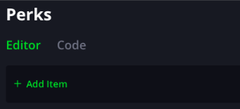

En la sección de **Goal** del crowdfund, establecemos el monto objetivo **Target Amount** y la moneda en la que se recaudarán los fondos. Si lo deseamos, también podemos definir una fecha de inicio y finalización para la campaña.

En **Contributions** (Contribuciones) tenemos las siguientes opciones:
- Ordenar los perks de contribución por popularidad.
- Mostrar el ranking de contribuciones.
- Mostrar el valor de las contribuciones.
- No permitir contribuciones adicionales después de alcanzar la meta (desactivado, lo que significa que se permitirán contribuciones extra).

**Crowdfund Behavior** (Comportamiento del Crowdfund)  
- Contar todas las facturas creadas en la tienda como parte del objetivo.

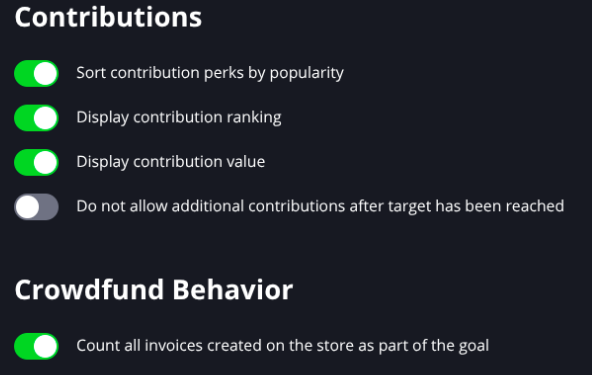

Adicionalmente, contamos con la opción de **Checkout**, que nos permite recopilar información de los donantes si es necesario. Esto puede incluir detalles como su nombre, correo electrónico o cualquier otro dato relevante para la campaña. Esta información puede ser útil para enviar agradecimientos, actualizar información sobre el progreso del proyecto o gestionar recompensas (perks).

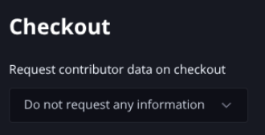

Y tenemos lista nuestra campaña:  
Puedes acceder a la campaña creada por el siguiente enlace:  
[https://btcpay.cubabitcoin.org/apps/2eEBDdwVo6DU9MrNkLRU6tEjgALB/crowdfund](https://btcpay.cubabitcoin.org/apps/2eEBDdwVo6DU9MrNkLRU6tEjgALB/crowdfund)

**NO VAYAS A DONAR NADA, SOLO TIENE CARÁCTER EDUCATIVO**

## 5 - Accediendo al servidor desde Cuba

En este capítulo exploraremos cómo acceder a BTCPay Server desde Cuba y si existen restricciones que puedan afectar su uso.

### 5.1 - ¿Existen restricciones de acceso?

En Cuba, el acceso a servicios internacionales puede verse afectado por limitaciones en la infraestructura de internet. Sin embargo, BTCPay Server ofrece una alternativa para que comerciantes y usuarios puedan recibir pagos en Bitcoin de forma sencilla y rápida. Las comisiones del servicio dependen del nodo Lightning al que el comerciante decida conectarse.

### 5.2 - ¿Es necesario usar VPN o Tor?

No es estrictamente necesario usar VPN o Tor para acceder al servidor de BTCPay de Cuba Bitcoin. Sin embargo, el uso de VPN o Tor es una buena práctica en términos de privacidad y seguridad. En algunos casos, debido a la velocidad de internet en Cuba, puede ser necesario omitir su uso para una experiencia de usuario más fluida.

Si deseas acceder al BTCPay de Cuba Bitcoin a través de Tor, puedes hacerlo mediante el siguiente enlace:  
[https://ovogendhlbsjnchomgigp5ndjjdrwpp27jiwn3cqkmlvrzh5y3tnbuqd.onion](https://ovogendhlbsjnchomgigp5ndjjdrwpp27jiwn3cqkmlvrzh5y3tnbuqd.onion)

Recuerda que debes utilizar el navegador Tor Browser para abrir este enlace:  
 -[Español](https://www.torproject.org/es/download/)  
 -[Inglés](https://www.torproject.org/download/)  

## 6. ¿Cómo puedes ayudar a la comunidad?

Puedes contribuir a la comunidad de Cuba Bitcoin de diversas maneras para fortalecer el uso de Bitcoin y Lightning Network en el país. A continuación, te mostramos algunas formas en las que puedes apoyar:

### 6.1 Donaciones para sostener el servicio:

El mantenimiento y funcionamiento de un servidor dedicado a BTCPay Service, LNBits y el Nodo de Lightning de Cuba Bitcoin requiere recursos y tiempo constantes. Las donaciones son esenciales para asegurar que este servicio siga disponible para todos los usuarios. Con tu contribución, por pequeña que sea, podremos cubrir gastos como el mantenimiento del servidor, las actualizaciones de seguridad, los costos operativos, la apertura de nuevos canales que mejoren la experiencia del usuario, la reducción de comisiones en las transferencias y la capacidad de aceptar pagos.

Las donaciones se pueden realizar a través de Bitcoin Lightning. Puedes donar a:
- cubabitcoin@lnbits.cubabitcoin.org
- cubabitcoin@walletofsatoshi.com

Muchas gracias.

### 6.2 Reporte de errores y sugerencias de mejora en la plataforma:

Tu participación en la mejora continua de la plataforma es muy importante para nosotros. Si encuentras errores o tienes ideas para mejorar el funcionamiento de BTCPay no dudes en reportarlos. Tu retroalimentación nos permite corregir fallos, mejorar la experiencia del usuario y mantener la plataforma eficiente y segura.

Puedes enviar tus reportes de errores y sugerencias comunicándote con los administradores en el grupo de Telegram de Cuba Bitcoin (Link). Toda colaboración es bienvenida y contribuye a fortalecer el proyecto.

### 6.3 Participación en la educación y difusión sobre Bitcoin en Cuba

La educación es el pilar fundamental de nuestra comunidad. Difundir el conocimiento sobre Bitcoin es clave para fomentar su adopción tanto en Cuba como en el resto del mundo. Puedes contribuir compartiendo tus conocimientos sobre esta tecnología, organizando talleres, charlas o simplemente difundiendo información clara y precisa sobre su funcionamiento. Al hacerlo, ayudarás a empoderar a más personas para que aprovechen los beneficios de Bitcoin en su vida diaria. Si deseas organizar un taller, meetup o clase en tu comunidad, puedes contar con el apoyo y la experiencia de la comunidad Cuba Bitcoin.

Además, puedes colaborar creando contenido educativo, compartiendo recursos o participando en actividades comunitarias. Síguenos en nuestras redes sociales y apóyanos con un "like" o un "retweet". Tu apoyo ayuda a que nuestro trabajo educativo llegue a más personas.

**Redes sociales:**
- **X:** [Cuba_BTC](https://x.com/Cuba_BTC)
- **Nostr:**
  - **NPUB:** npub1huyn6ru55pv6l7p0sxvlu3vfpq7pan958sl4weft0kte6lvdvvksd5s34t
  - **NIP05:**
  - cubabitcoin@btcpay.cubabitcoin.org

## 7 - Conclusión

A lo largo de este tutorial, hemos explorado cómo BTCPay Server se puede utilizar como una herramienta poderosa para facilitar pagos en Bitcoin. En esta sección, discutiremos los próximos pasos para continuar promoviendo su uso y evolución, así como cómo puede adaptarse aún más a las necesidades de los usuarios cubanos y de la región.

### 7.1 - Próximos pasos y cómo BTCPay Server puede seguir evolucionando en la comunidad

BTCPay Server ha demostrado ser una solución eficiente para recibir pagos en Bitcoin de manera descentralizada y segura. 

Los próximos pasos incluyen mejorar la educación sobre su uso, continuar con la integración de nuevas funcionalidades y trabajar en facilitar el acceso a más personas, a pesar de las posibles restricciones de acceso a internet. 

A medida que la comunidad crezca, BTCPay Server seguirá evolucionando, adaptándose mejor a las necesidades locales y fortaleciendo aún más el ecosistema de Bitcoin en Cuba y el mundo.

---

**Autores:**

**Forte11** y **BTCLNAT**

---

### Forte11

Sígueme en X: [https://x.com/Forte11Cuba](https://x.com/Forte11Cuba)

Sígueme en Nostr:
- npub1f0rtesc8yd8utjhpgktlltv4t2rftxd5kmkagt5kymt8946pqf7qe90snx
- forte11@cubabitcoin.org

Regálame un cafecito con Lightning Network: forte11@lnbits.cubabitcoin.org

### BTCLNAT

Sígueme en X: [https://x.com/delgadoamaran](https://x.com/delgadoamaran)  
Sígueme en Stackers News: [https://stacker.news/BTCLNAT](https://stacker.news/BTCLNAT)  

Sígueme en Nostr:
- npub1dhttjg8sjk4arx0qywsu9s7c09sxagrz5kktvsl78dfqwy9er
- btclnat@stackers.news

Regálame un cafecito con Lightning Network: btclnat@lnbits.cubabitcoin.org

