# Cashu Básico

1. [Introducción](#1---introducción)  
1.1. [Breve historia del protocolo](#11---breve-historia-del-protocolo)  
1.2. [Contexto actual de Cuba e importancia de Cashu para la comunidad](#12---contexto-actual-de-cuba-e-importancia-de-cashu-para-la-comunidad)  
2. [Conceptos básicos de Cashu](#2---conceptos-básicos-de-cashu)  
2.1. [¿Qué son los mints?](#21---qué-son-los-mints)  
2.2. [¿Qué son los tokens Cashu?](#22---qué-son-los-tokens-cashu)  
2.3. [¿Cómo funcionan los pagos offline?](#23---cómo-funcionan-los-pagos-offline)  
2.4. [Flujo básico](#24---flujo-básico)  
3. [Configuración inicial de Cashu](#3---configuración-inicial-de-cashu)  
3.1. [Instalación de una wallet compatible](#31---instalación-de-una-wallet-compatible)  
3.2. [Guardando la semilla](#32---guardando-la-semilla)  
3.3. [Conexión a un mint Cashu](#33---conexión-a-un-mint-cashu)  
4. [Uso básico de Cashu](#4---uso-básico-de-cashu)  
4.1. [Creación de tokens Cashu](#41---creación-de-tokens-cashu)  
4.2. [Enviar pagos con Cashu](#42---enviar-pagos-con-cashu)  
4.3. [Recepción de tokens Cashu](#43---recepción-de-tokens-cashu)  
4.4. [Verificación del saldo](#44---verificación-del-saldo)  
4.5. [Intercambiar tokens entre mints (Swaps)](#45---intercambiar-tokens-entre-mints-swaps)  
5. [Integraciones con la comunidad Cuba Bitcoin](#5---integraciones-con-la-comunidad-cuba-bitcoin)  
5.1. [Ejemplos de uso en comercios locales](#51---ejemplos-de-uso-en-comercios-locales)  
5.2. [Facilidad de pago para viajeros](#52---facilidad-de-pago-para-viajeros)  
6. [Retos y soluciones](#6---retos-y-soluciones)  
6.1. [Restricciones de conectividad](#61---restricciones-de-conectividad)  
6.2. [Alternativas para usar Cashu sin internet constante](#62---alternativas-para-usar-cashu-sin-internet-constante)  
6.3. [Confianza en el Mint](#63---confianza-en-el-mint)  
6.4. [Riesgos de recibir pagos sin conexión](#64---riesgos-de-recibir-pagos-sin-conexión)  
7. [Cómo contribuir a la comunidad](#7---cómo-contribuir-a-la-comunidad)  
7.1. [Difusión de Cashu en Cuba](#71---difusión-de-cashu-en-cuba)  
7.2. [Reporte de problemas y sugerencias](#72---reporte-de-problemas-y-sugerencias)  
7.3. [El futuro de Cashu en la comunidad Cuba Bitcoin](#73---el-futuro-de-cashu-en-la-comunidad-cuba-bitcoin)  

## 1 - Introducción

Hola. Estamos muy contentos de compartir este tutorial sencillo sobre Cashu Básico, creado con cariño por el equipo de Cuba Bitcoin. 
En los últimos meses, Cuba ha enfrentado cortes eléctricos que han dejado sin funcionar cajeros, plataformas de pago y, a las pocas horas, el internet. En un entorno tan desafiante, encontramos en Cashu una solución increíble. Estás a punto de conocer un protocolo que permite hacer pagos con Bitcoin incluso sin conexión a internet. 
En este tutorial, te guiaremos paso a paso para que, sin complicaciones ni tecnicismos, puedas usarlo y contribuir a un comercio más fuerte y resiliente. Veremos como Cashu puede cambiar las reglas del juego.

### 1.1 - Breve historia del protocolo

El protocolo Cashu es una implementación moderna de eCash, un concepto de dinero digital creado en 1982 por el criptógrafo David Chaum, quien introdujo las firmas ciegas para garantizar transacciones privadas. Aunque su empresa DigiCash intentó integrarlo en los años 90, la dependencia de sistemas bancarios centralizados lo llevó al fracaso.

Puedes profundizar más en eCash con este pod de Lunatcoin:  
[Creación y evolución del eCash: Chaumian Mints, Fedimint y Cashu](https://www.youtube.com/watch?v=_XmQSpAhFN4)  

Con Bitcoin, creado por Satoshi Nakamoto en 2009, nació una forma descentralizada de revivir eCash. En octubre de 2022, un desarrollador llamado [Calle](https://x.com/callebtc) lanzó [Cashu](https://github.com/cashubtc), un protocolo que combina la privacidad de eCash con la velocidad de la red Lightning de Bitcoin, permitiendo hacer pagos rápidos, privados y, lo mejor, sin necesidad de internet, ideal para Cuba frente a cortes eléctricos y de conexión. Con Cashu, puedes "tokenizar" satoshis en tu celular a través de las Casas de la Moneda o  los Mints, lugares que emiten estos tokens, algo que explicaremos más adelante.

### 1.2 - Contexto actual de Cuba e importancia de Cashu para la comunidad

En los últimos meses, Cuba ha enfrentado constantes apagones que limitan la electricidad a solo 1 a 4 horas al día en muchos pueblos, y la conexión a internet, cuando existe, es intermitente y más lenta que 1 Mbps. A esto se suman cuatro cortes masivos del sistema eléctrico nacional entre octubre de 2024 y marzo de 2025, que han paralizado el país: los cajeros automáticos dejan de funcionar, las aplicaciones bancarias colapsan y el internet desaparece en pocas horas. Es una realidad dura, donde el comercio y la vida cotidiana se detienen por completo.
Frente a este desafío, el equipo de Cuba Bitcoin buscó soluciones para mantener el comercio vivo incluso sin electricidad ni internet. Después de evaluar varias opciones, elegimos Cashu, un protocolo que nos permite hacer pagos con Bitcoin usando solo un celular con batería. Con Cashu, las transacciones son rápidas, privadas y no dependen de bancos o conexión a internet. Esto significa que, aunque todo falle, puedes seguir comprando y vendiendo. Cashu no es solo un protocolo, es una forma de empoderar al pueblo cubano.

_Nota: Puedes consultar más sobre los cortes eléctricos en noticias oficiales del gobierno de Cuba:_

[Octubre 2024](http://www.cubadebate.cu/noticias/2024/10/18/salida-imprevista-de-la-cta-antonio-guiteras-provoca-desconexion-total-del-sistema-electroenergetico-nacional/)  
[Noviembre 2024](http://www.cubadebate.cu/noticias/2024/11/06/fuertes-vientos-del-huracan-rafael-provocan-la-desconexion-del-sistema-electrico-nacional/)  
[Diciembre 2024](http://www.cubadebate.cu/noticias/2024/12/04/se-produce-nueva-desconexion-del-sistema-electroenergetico-nacional-en-la-madrugada-de-este-miercoles/)  
[Marzo 2025](http://www.cubadebate.cu/noticias/2025/03/14/se-produce-desconexion-del-sistema-electrico-nacional/)  

## 2 - Conceptos básicos de Cashu
En este capítulo entenderás algunos conceptos básicos sobre el funcionamiento de Cashu antes de empezar con la parte práctica de este tutorial. Aquí te explicamos tres ideas clave del protocolo.

### 2.1 - ¿Qué son los mints?
Un mint o Casa de la Moneda es como un casino que cambia tus satoshis (sats) por fichas digitales, llamadas tokens Cashu, que representan su valor. También puedes pensar en una tienda comunitaria que te da vales para comprar, respaldados por el dinero que entregaste. El dinero papel representó un pagaré o promesa de pago por oro.
En Cashu, los mints son operados por personas o comunidades de confianza y usan la red Lightning para garantizar que tus tokens estén respaldados por Bitcoin.

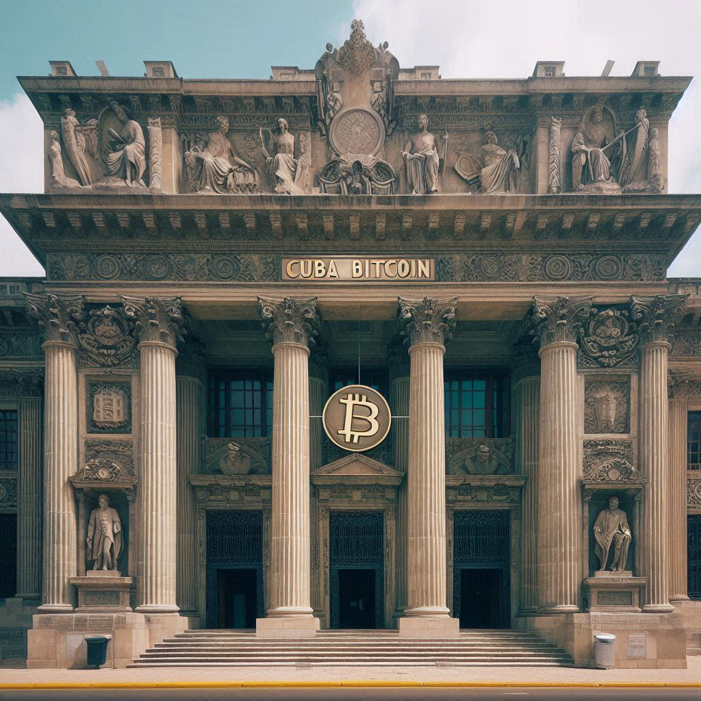  
Casa de la moneda de Cuba Bitcoin en dónde no se acuñan monedas, se acuñan nueces.

### 2.2 - ¿Qué son los tokens Cashu?

Los tokens Cashu son como billetes digitales que representan satoshis, la unidad más pequeña de Bitcoin. Imagina que tienes vales electrónicos en tu celular, firmados criptográficamente por un mint, que puedes usar para pagar en una tienda sin necesidad de papel. Estos tokens te permiten hacer pagos rápidos y privados, ya que nadie puede rastrear quién los envió o recibió.

  

### 2.3 - ¿Cómo funcionan los pagos offline?

Los pagos offline con Cashu funcionan porque los tokens Cashu están guardados directamente en tu celular, como si llevaras billetes en tu bolsillo. Estos tokens son seguros porque el mint los firma digitalmente, garantizando que son válidos. Para pagar, solo necesitas compartir tus tokens con otra persona, por ejemplo, escaneando un código QR o enviando un texto corto con una aplicación de billetera Cashu. Una vez que tengas conexión de nuevo al mint, este verifica los tokens para asegurar que todo esté en orden.

### 2.4 - Flujo básico

El siguiente diagrama muestra cómo funciona de forma básica la emisión y transferencia de Cashu:

1. **Envío de sats al Mint:** El usuario envía sats al Mint a través de la red Lightning.  
2. **Emisión de tokens Cashu:** El Mint recibe los sats y, a cambio, emite tokens Cashu equivalentes, que entrega al usuario.  
3. **Transferencia entre personas:** El usuario puede transferir sus tokens Cashu a otra persona. Esta puede guardarlos en su dispositivo, usarlos para pagar a otra persona o canjearlos por sats nuevamente vía Lightning.

Este sistema permite transferencias privadas, instantáneas y sin necesidad de una conexión directa entre el emisor y el receptor.

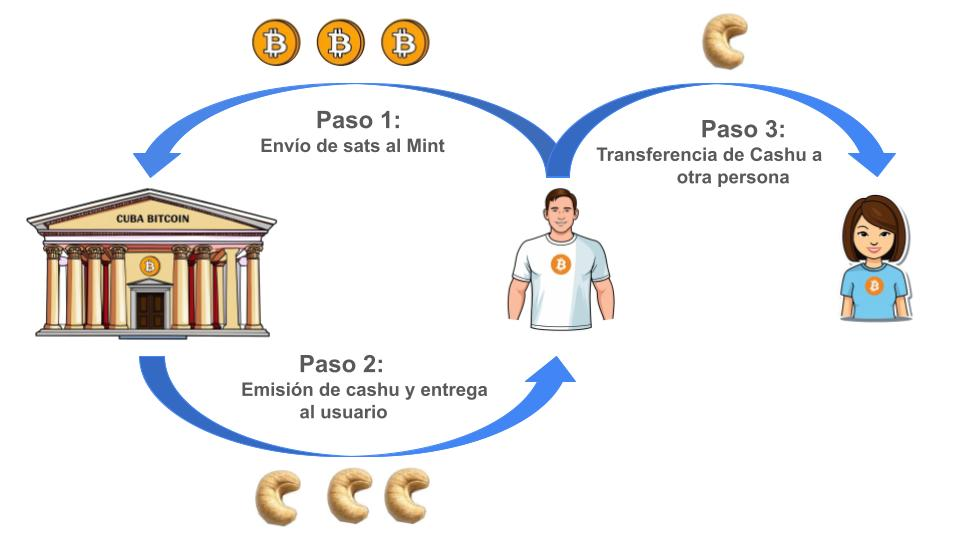  

## 3 - Configuración inicial de Cashu
En este capítulo, explicaremos los pasos esenciales para comenzar a usar Cashu. Aprenderás cómo configurar una wallet y conectarla a un mint específico. Esta configuración inicial es el primer paso para aprovechar este protocolo en tu comunidad.

### 3.1 - Instalación de una wallet compatible
Hay varias carteras (wallets) que funcionan con el protocolo de Cashu, pero para aprender lo básico vamos a usar una bien sencilla y accesible:   [cashu.me](cashu.me)   
Solo tienes que abrir el navegador de tu teléfono o computadora y entrar a esa dirección.

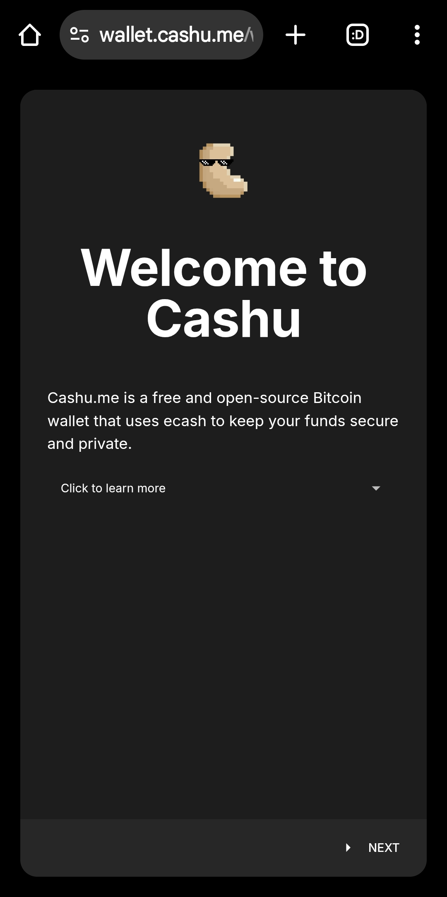  
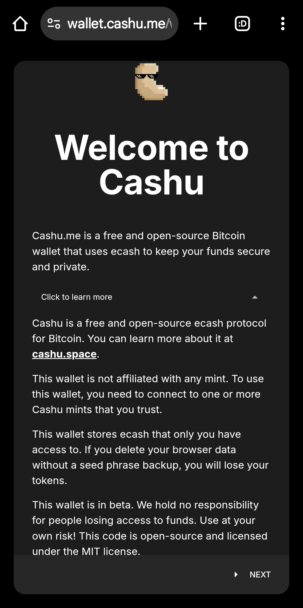  

Una vez ahí, verás un botón que dice “Next”. Dale clic para seguir avanzando.

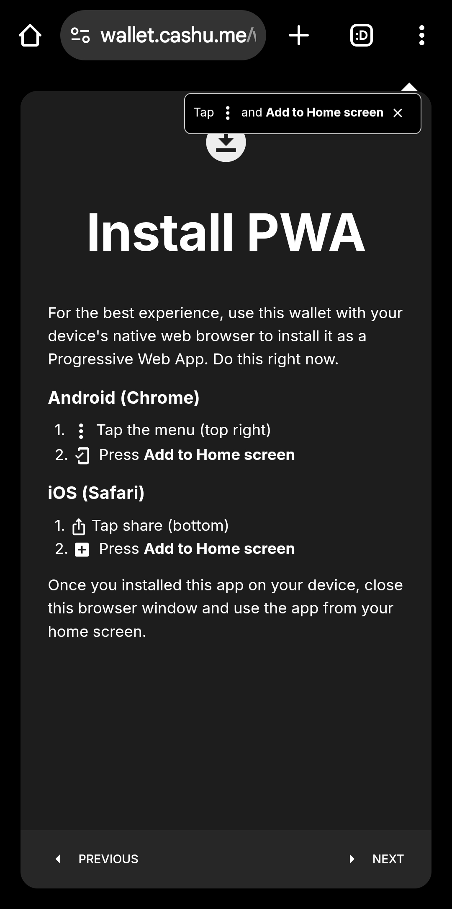  

En esta parte, la página te cuenta que se trata de una PWA (Progressive Web App), que es como una mezcla entre página web y aplicación. Puedes instalarla como si fuera una app normal en tu dispositivo.  
Para hacerlo, toca los tres punticos (⋮) que están en la esquina superior derecha del navegador y selecciona la opción que dice “Agregar a pantalla de inicio” o “Add to Home screen” (depende del idioma de tu navegador). Luego confirma que quieres instalarla.

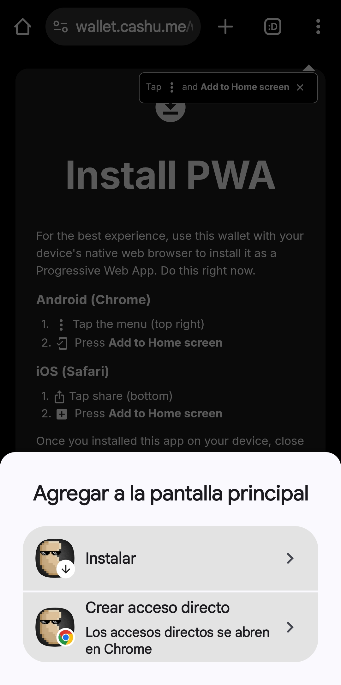  
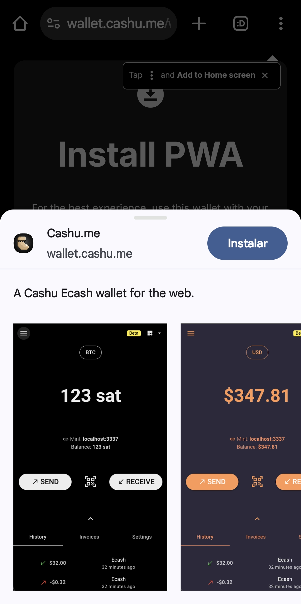  

Ahora tienes una aplicación de Cashu directamente en tu teléfono, lista para usar como cualquier otra app.

### 3.2 - Guardando la semilla
Una vez sigamos avanzando en la app, nos va a mostrar 12 palabras. Estas son muy importantes ya que son la clave para entrar a tu cartera y recuperar tus monedas si pierdes el teléfono o cambias de dispositivo. Tienes que guardarlas en un lugar seguro, fuera del teléfono si es posible. Escríbelas en un papel, guárdalas en una libreta. No las pierdas ni las compartas con nadie.  
Para ver las palabras, toca el ícono del ojito que aparece en la pantalla.

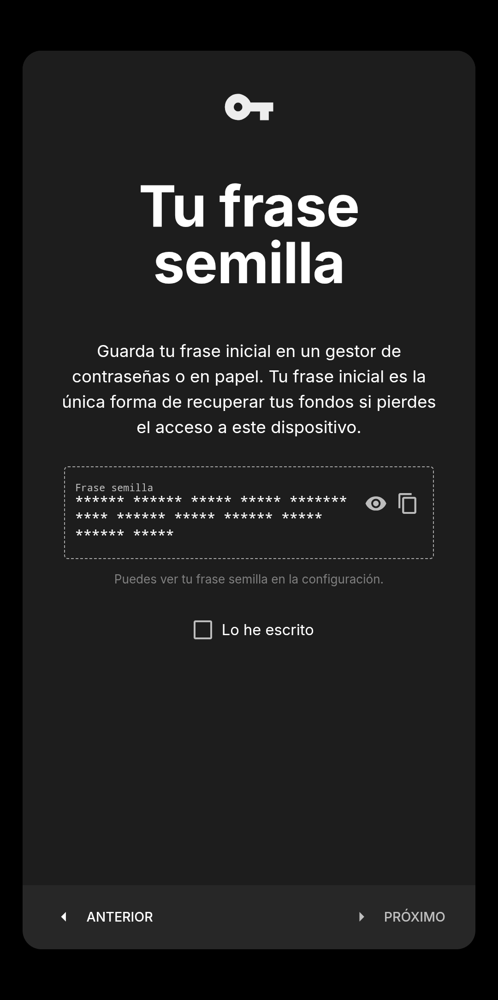  
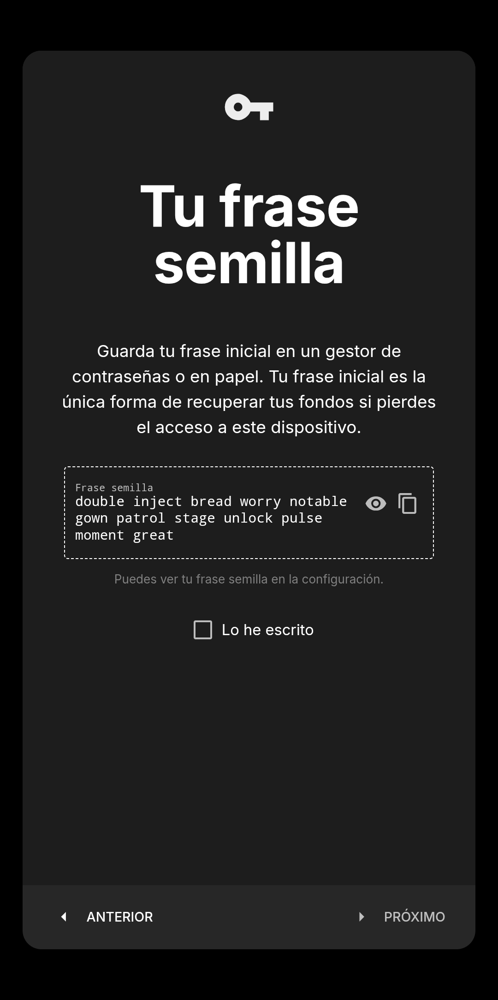  

Después que las hayas copiado bien, marca la casilla que dice “I have written it down” (ya las escribí) y dale al botón Next para continuar.

### 3.3 - Conexión a un mint Cashu
El siguiente paso es conectarnos a un Mint, también conocido como una Casa de la Moneda. Este es un componente clave en el uso de Cashu, porque es el encargado de emitir y verificar los tokens que vas a usar.  
El Mint que elijas debe ser de tu confianza. Estás confiando en él para que cuide tu dinero y emita tokens válidos. Si el mint promete entregar tokens respaldados 1 a 1 con sats reales, entonces funciona como un banco de reserva completa: no presta tu dinero, simplemente lo guarda y lo respalda con bitcoin. También existen otros tipos de mints llamados Stable Mints, los cuales emiten tokens que representan monedas fiat como el dólar (USD). En ese caso, tus tokens estarían representando en valor 1 a 1 con USD, pero eso ya es otro tema que se escapa del objetivo de este tutorial.  
Ahora vamos a agregar el mint de Cuba Bitcoin pensado para nuestra realidad.  
Para eso, en la aplicación, buscamos la opción que dice “ADD MINT”.  
Vamos a adicionar el mint de Cuba Bitcoin. Para ello vamos hasta el apartado de “ADD MINT”. 

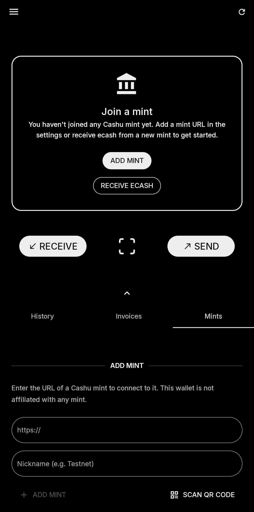  

En el primer campo, escribimos la dirección del mint:  
**https://mint.cubabitcoin.org**  
Luego, donde dice **“Nickname”**, puedes poner el nombre que tú prefieras. Por ejemplo, le puedes poner **“Cuba Bitcoin”** para identificarlo fácilmente.  

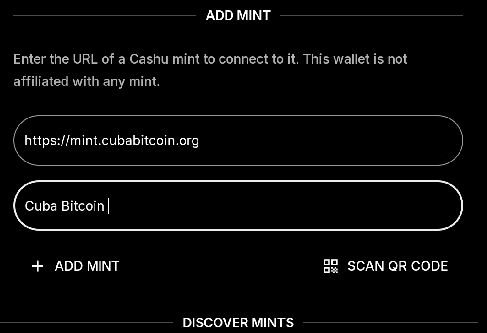  

Ya tienes tu mint conectado. Ahora sí estás preparado para empezar a usar tus tokens Cashu.

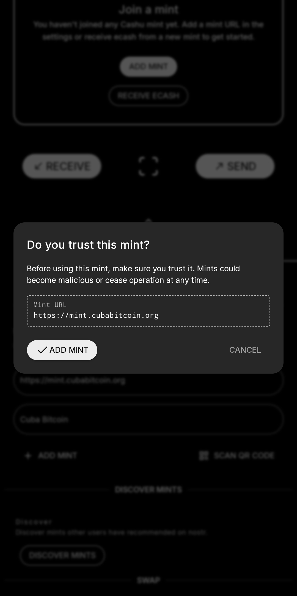  
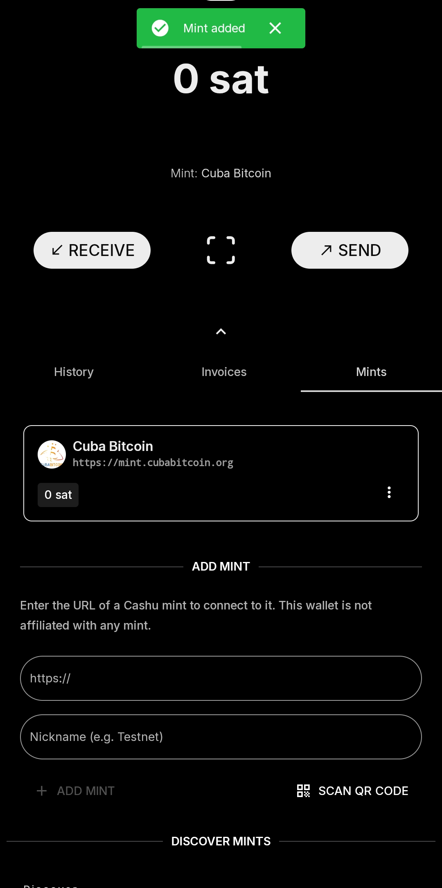  
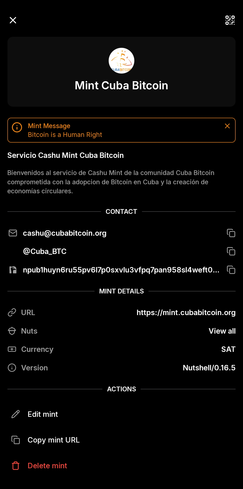  

## 4 - Uso básico de Cashu
Ahora que ya tienes tu wallet instalada y conectada a un mint, es hora de poner Cashu en acción.  
En este capítulo, vamos a cubrir lo esencial para que puedas moverte con confianza: cómo recibir tokens, cómo enviarlos a otra persona y cómo verificar tu saldo.  
Aquí es donde empieza la verdadera magia de este protocolo: dinero digital, rápido, privado y fácil de usar. Además, veremos en qué momentos necesitarás conexión a internet y en cuáles podrás operar sin ella.

### 4.1 - Creación de tokens Cashu

Recuerda que para que el mint te cree tokens Cashu, primero necesitas enviar Bitcoin a través de Lightning Network.

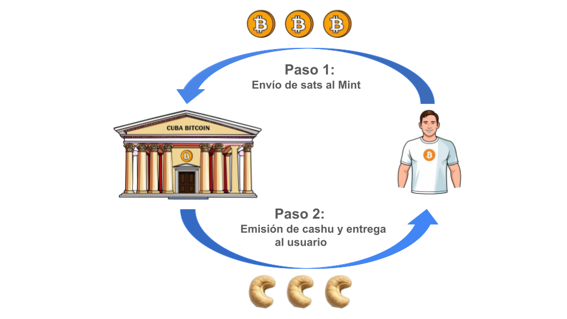  

Primero, abre la opción Receive (Recibir) en tu wallet y selecciona Lightning como método de pago.

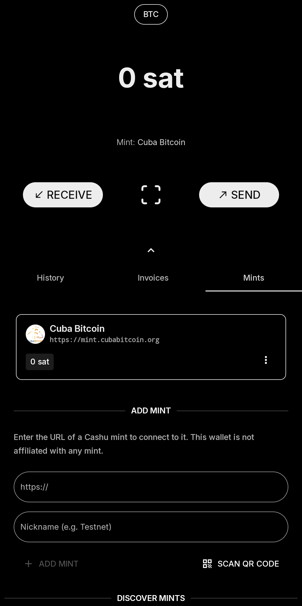  

Luego, selecciona el mint al que vas a enviar los fondos. En este ejemplo, vamos a usar Cuba Bitcoin. Después, agrega la cantidad de sats que deseas enviar.

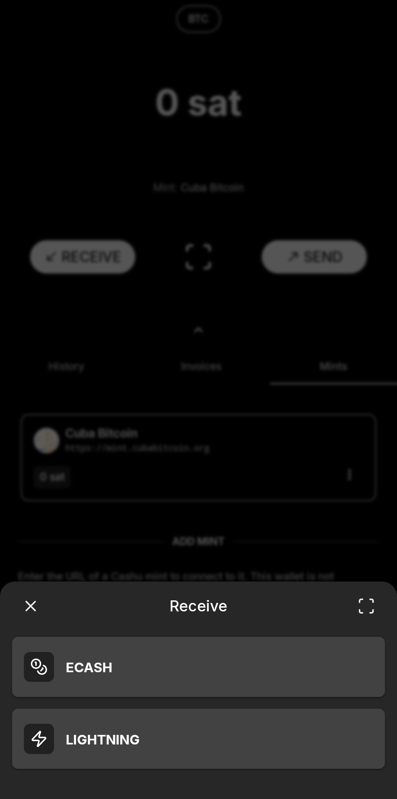  

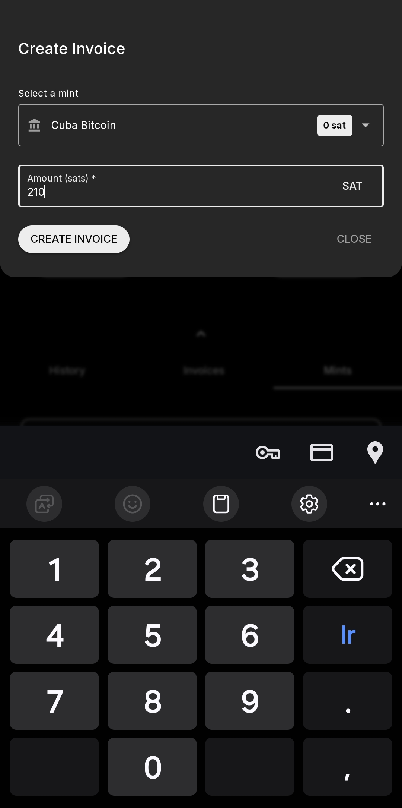  

Una vez tengas todo listo, simplemente paga la invoice (factura)  y listo, ya tienes tus primeros tokens Cashu minteados desde Cuba Bitcoin.

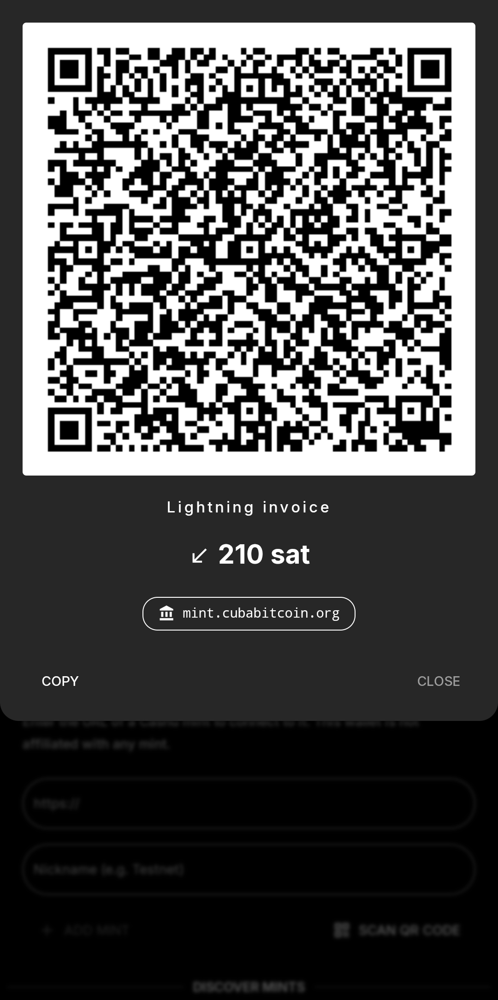  

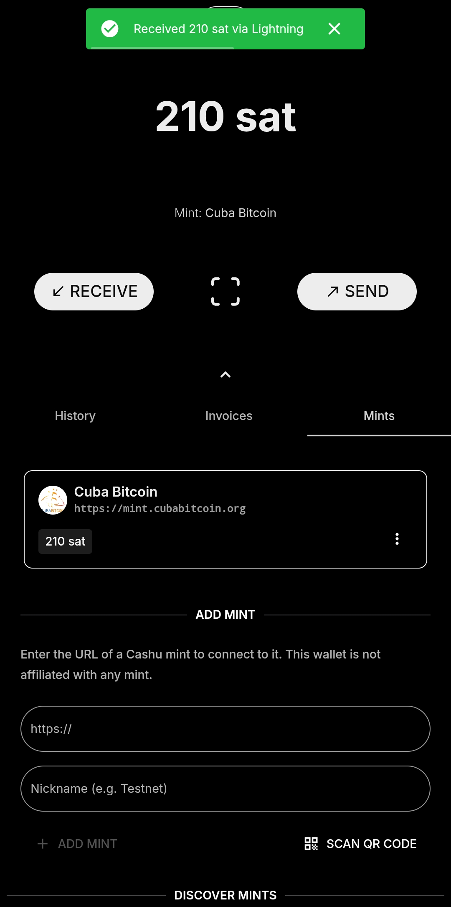  

**Importante:** Para crear tokens Cashu, siempre necesitas estar conectado al mint. Sin conexión, no podrás generar nuevos tokens.

### 4.2 - Enviar pagos con Cashu

Para enviar tokens Cashu, abre la opción Send (Enviar) en tu wallet y selecciona eCash como método de pago.  
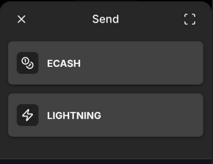  

Luego, elige el mint desde el cual quieres enviar los tokens.  
**Importante:** Este paso lo puedes hacer incluso sin conexión a internet. Tú puedes estar completamente offline al generar el pago.

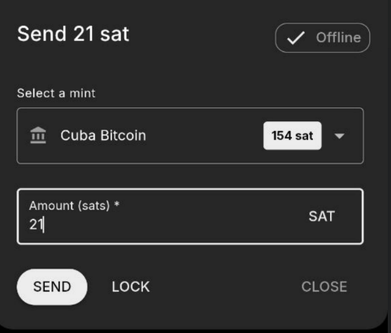  

Después de eso, se genera un código QR que la otra persona puede escanear para recibir los tokens. También puedes copiar la información y enviarla por otro medio, como un SMS si no dispones de internet.

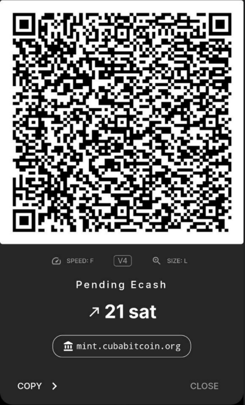  

Y así, de forma rápida y sencilla, puedes enviar tokens Cashu.

### 4.3 - Recepción de tokens Cashu

Para entender bien cómo funciona la recepción de tokens Cashu, te recomendamos hacer una pequeña simulación. Puedes crear una wallet en otro dispositivo usando una clave diferente, o simplemente utilizar otra wallet compatible de Cashu en el mismo dispositivo.  
Primero, abre la opción Receive (Recibir) en tu wallet y selecciona eCash como método de pago.

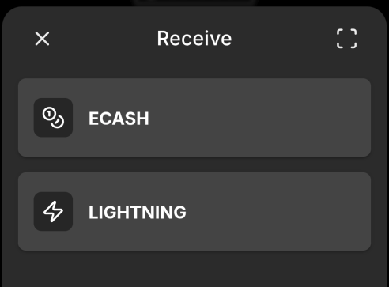  

Luego, tienes varias formas de ingresar el pago: puedes pegar el mensaje, escanear un QR, e incluso usar NFC (si tu dispositivo lo permite).  
Ten en cuenta que esta app funciona como una PWA (aplicación web progresiva), por lo que en algunos dispositivos ciertas funciones podrían comportarse de forma diferente por temas de compatibilidad.

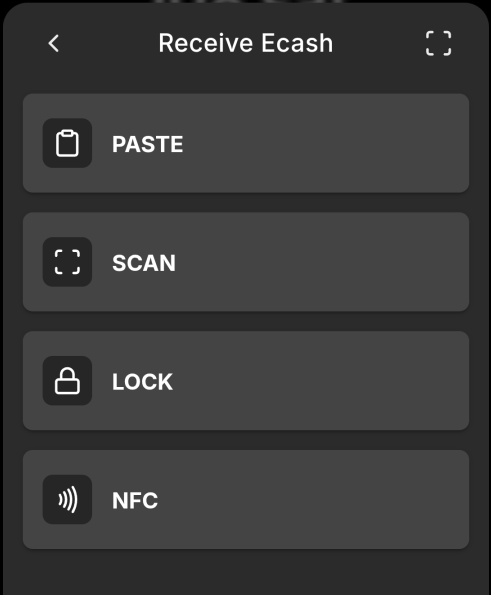  

Una vez ingresado el token, la wallet te mostrará tres opciones:  
**Receive (Recibir)**

**Later (Más tarde)**

**Close (Cerrar)**

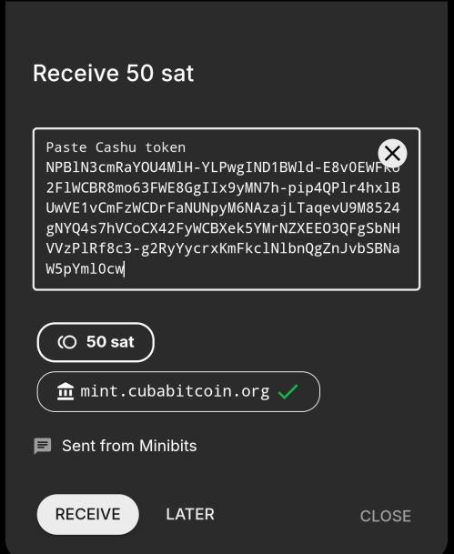  

Si no tienes acceso a internet en ese momento, puedes elegir la opción Later, y el token quedará guardado para ser reclamado más adelante.  
Cuando usas la opción Later, la transacción pendiente aparece en la sección History.

  

Al ir a History, verás la transacción guardada con un iconito de una flecha hacia abajo al lado derecho.

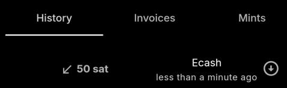  

Si presionas esa flecha, la wallet te mostrará los detalles de la transacción y te dará la opción de presionar Receive.  
Si en ese momento tienes conexión a internet, podrás reclamar los tokens y verás un cartel verde en la parte superior confirmando que han sido recibidos con éxito.

  

Y así, podemos recibir tokens Cashu, incluso si estás offline al principio.

### 4.4 - Verificación del saldo

Después de recibir o enviar tokens, es normal que te preguntes: “¿Cuánto me queda?”  
Para revisar el saldo solo tienes que abrir tu wallet y, en la pantalla principal, verás el saldo total disponible, dividido por cada mint que tengas agregado.  
Esto te permite saber cuántos sats tienes y en qué mint están respaldados.  
Recuerda que para ver el saldo actualizado necesitas conexión al mint correspondiente. Si estás sin internet, verás el saldo estimado según tus últimas operaciones, pero no se actualizará hasta reconectarte.

### 4.5 - Intercambiar tokens entre mints (Swaps)

Si en algún momento decides cambiar de casa de la moneda (mint), ya sea por confianza, necesidad o simple curiosidad, puedes hacer un swap o intercambio entre mints.

En tu wallet de cashu.me, encontrarás una sección llamada Discover mints. Al hacer clic en la opción “Click to browse mints”, se abrirá una lista de mints publicados en la página bitcoinmints.com, todos con al menos una reseña o evaluación.

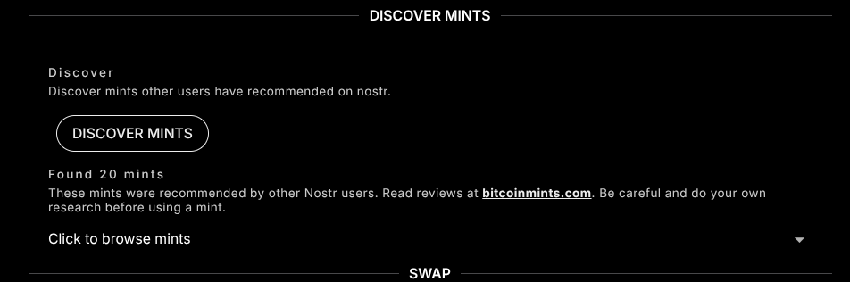  
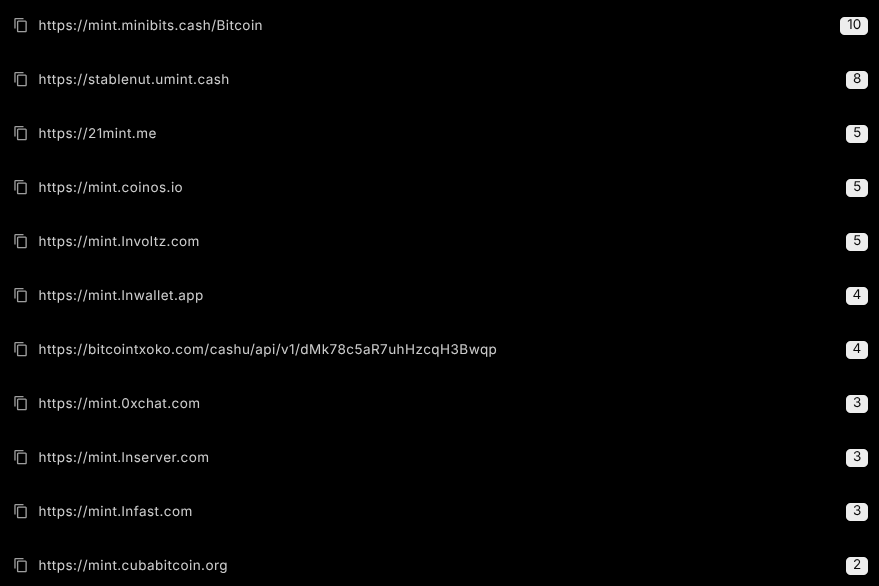  

Para este ejemplo, vamos a añadir el mint de Minibits, un proyecto muy sólido que incluso tiene su propia billetera. Te recomendamos explorarlo por tu cuenta si te interesa.

Es importante tener claro que los tokens Cashu no son interoperables entre mints distintos. Cada mint emite sus propios tokens y no reconoce los de otros. Por eso, el proceso de intercambio se hace en tres pasos:

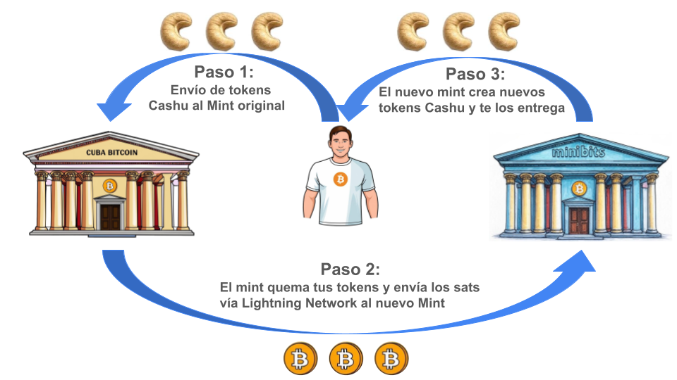  

1. Envías tus tokens Cashu al mint actual (en este caso, Cuba Bitcoin).
2. El mint los quema (los destruye) y, usando la red Lightning, envía los sats al nuevo mint.
3. El nuevo mint (por ejemplo, Minibits) recibe los sats y genera nuevos tokens Cashu que te entrega.

Una vez que hayas añadido el mint de destino, ve a la opción Swaps en la wallet. En nuestro ejemplo, vamos a enviar desde Cuba Bitcoin hacia Minibits.  
En la opción From, seleccionamos Cuba Bitcoin, y en To, seleccionamos Minibits. Luego indicamos la cantidad a enviar. Para este ejemplo, probaremos con 21 sats.

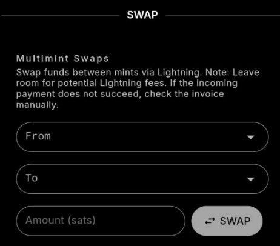  
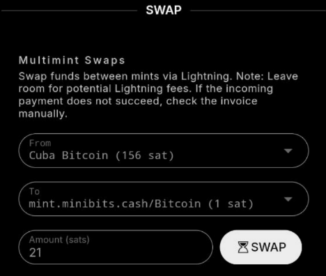  

Le damos al botón de Swap, y listo. En la parte superior de la wallet verás el resumen: cuánto se envió, cuánto se recibió y si hubo comisión.  
Este proceso se hace usando Lightning Network, que a veces cobra una comisión dependiendo de cómo se enrute el pago.  
Y así, fácil y rápido, ya tienes tus nuevos tokens en otro mint.  

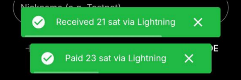  

## 5 - Integraciones con la comunidad Cuba Bitcoin

En este capítulo vamos a explorar cómo Cashu puede integrarse en el día a día de nuestra comunidad, especialmente en entornos donde el acceso a internet, los servicios bancarios y el efectivo son problemáticos. Veremos ejemplos concretos de cómo esta tecnología puede facilitar la vida cotidiana de comerciantes y usuarios en Cuba.

### 5.1 - Ejemplos de uso en comercios locales

Cuba enfrenta una combinación compleja de desafíos: apagones frecuentes, internet inestable y una crisis de efectivo persistente. Además, las aplicaciones bancarias oficiales funcionan de manera irregular, lo que complica aún más las transacciones cotidianas.  
En este contexto, Cashu ofrece una alternativa poderosa y simple. Al aceptar pagos con tokens Cashu, los comerciantes se liberan de varias limitaciones:  
- No dependen de servicios bancarios frágiles.  
- Pueden recibir pagos incluso sin conexión inmediata a internet.  
- Ofrecen a sus clientes una vía de pago rápida, privada y sin fricción.

Cashu es ideal para sobrevivir (y prosperar) en un entorno tan caótico como el cubano.

### 5.2 - Facilidad de pago para viajeros

Durante una lluvia de ideas del equipo de Cuba Bitcoin, a @hhobbitt (@hobbit9708) se le ocurrió una solución brillante para quienes visitan la isla:  
mintear tokens Cashu desde el mint comunitario de Cuba Bitcoin antes de emprender su viaje.

Si el viajero se queda sin conexión a internet (algo bastante común en Cuba), o no logra conseguir una SIM cubana —que muchas veces es un dolor de cabeza—, igual podrá pagar bienes y servicios locales usando Cashu.

Gracias al diseño del protocolo, estos pagos pueden hacerse de forma offline, siempre que ambas partes tengan una wallet.

Para que este esquema funcione de manera fluida, los comerciantes locales deben:

- Conocer cómo funciona Bitcoin y Lightning Network.
- Estar dispuestos a aceptar pagos en Cashu, ya sea con su propio dispositivo o con una wallet compartida del negocio.
- Reclamar los tokens cuando tengan conexión a internet, si están offline en el momento del pago.

Esta propuesta abre la puerta a un ecosistema de pagos descentralizado, privado y sin fricciones, pensado tanto para turistas como para cubanos. Una alternativa realista y práctica frente al caos del efectivo, la mala conectividad y las limitaciones bancarias de la isla.

## 6 - Retos y soluciones

Usar Cashu en Cuba tiene sus particularidades. Aunque el protocolo fue diseñado para operar incluso con baja conectividad, existen retos reales que debemos considerar para sacarle el mayor provecho dentro del contexto cubano.  
Y como en todo: para cada reto, existe una solución.  
En este capítulo exploramos los obstáculos más comunes y compartimos buenas prácticas para enfrentarlos.

### 6.1 - Restricciones de conectividad

Cuba enfrenta serias limitaciones en cuanto a conectividad: zonas sin cobertura, conexiones lentas e inestables, y acceso irregular al internet móvil. Además, no todos los usuarios tienen datos móviles constantes ni acceso diario a una red Wi-Fi confiable. Estos factores pueden dificultar el uso fluido de herramientas digitales como Lightning o la conexión directa con un mint.

### 6.2 - Alternativas para usar Cashu sin internet constante

Cashu es una solución resiliente.  
Una buena práctica, especialmente si formas parte de una comunidad que acepta Cashu, es mantener tokens listos para usar en caso de cortes prolongados de internet o apagones.  
Supongamos que prevés que un apagón general puede durar hasta 5 días. Durante ese tiempo, estimas que gastarás unos 30 USD en productos básicos.  
Esos 30 USD puedes tenerlos minteados en tu wallet de antemano, listos para usar en cualquier momento, sin depender de estar conectado.  
Así, el comercio no se detiene. Tampoco la vida.

### 6.3 - Confianza en el Mint

Al usar Cashu, estás depositando tu confianza en el mint que emite los tokens, ya que este es el responsable de garantizar que estos sean válidos y estén respaldados por la cantidad correcta de Bitcoin.  
Es fundamental elegir un mint que te ofrezca seguridad y confianza. El mint de Cuba Bitcoin es una excelente opción local, creado específicamente para nuestra comunidad, aunque también puede ser utilizado por personas de cualquier parte del mundo. No obstante, independientemente del mint que elijas, asegúrate siempre de que lo estén operando de manera ética.  
Aunque los mints no son bancos tradicionales, su funcionamiento se asemeja al de un "banco de reserva completa", lo que significa que los tokens emitidos están respaldados 1:1 por Bitcoin. Esto garantiza que no se emiten más tokens de los que realmente existen en reserva.  
Es recomendable que revises la reputación del mint que decidas usar, investigues las reseñas de otros usuarios y te mantengas al tanto de cualquier actualización relevante sobre su funcionamiento.

**IMPORTANTE:** Aunque Cashu es una excelente herramienta para realizar transacciones rápidas, privadas y offline, no está diseñado para almacenar grandes cantidades de dinero a largo plazo (aunque podrías hacerlo si lo deseas). El protocolo está pensado para facilitar transacciones cotidianas. Te recomendamos mantener solo la cantidad de tokens que necesites para tus pagos inmediatos o que sepas que vas a necesitar en un futuro cercano.

### 6.4 - Riesgos de recibir pagos sin conexión

Recibir tokens Cashu sin conexión puede ser una herramienta muy útil en entornos con internet inestable, pero también conlleva ciertos riesgos que debes tener en cuenta.  
En el caso de Cashu.me, al ser una Progressive Web App (PWA), algunos dispositivos o navegadores pueden tener problemas para guardar datos offline de manera confiable.  
Antes de usarlo en situaciones críticas, te recomendamos probar el flujo completo: "Receive", "Later", "History", "Receive". Además, asegúrate de utilizar navegadores recomendados, como Chrome o Firefox, para evitar posibles fallos.  
Si encuentras problemas, considera probar otras wallets de Cashu, como Nutstash o Minibits.

Tu saldo mostrado offline es solo una estimación basada en tu última sincronización. Si haces varias transacciones sin reconectar, podrías quedarte sin ver que tu balance real es menor.  
Mantén un colchón de tokens sin gastar para emergencias y evita quedarte a “cero” mientras sigues offline.

Cuando aceptas un pago en modo offline (usando la opción "Later"), ese token quedará marcado como pendiente en tu wallet hasta que restablezcas la conexión.  
Por eso, es importante que revises regularmente la sección History de tu wallet y reclames los pagos tan pronto como tengas acceso a internet nuevamente.

Aunque el protocolo Cashu previene el doble gasto a nivel de mint, si compartes tu wallet con otras personas o usas un dispositivo que no es totalmente seguro, existe el riesgo de que te roben los tokens.  
Es crucial que mantengas tu dispositivo protegido y nunca compartas tu seed phrase con nadie.

Al realizar un pago offline, no se obtiene una confirmación inmediata de que el vendedor haya recibido realmente el token.  
Esto podría generar confusión si la otra persona no reclama el pago.  
Para evitar malentendidos, es importante comunicar claramente el procedimiento: asegúrate de indicarle al vendedor cómo acceder y reclamar la transacción desde la sección History de su wallet, o incluso envíale el QR con instrucciones claras para que lo haga.

Uno de los riesgos de recibir pagos offline es que la persona que te envió el pago podría intentar usar el mismo token Cashu para pagar a otro comerciante o incluso intentar cobrarlo nuevamente.  
Para prevenir esta situación, el comprador puede bloquear esos tokens utilizando tu clave pública en la aplicación o de tu perfil en Nostr.  
Este procedimiento requiere estar conectado al mint para firmar el pago, pero para recibir y cobrar el pago en el futuro, no es necesario estar conectado en ese momento.  
Si deseas profundizar en este aspecto de la firma de pagos, te invitamos a investigar más a fondo mientras preparamos un tutorial específico sobre este tema.

Si ambas partes están offline, la confianza mutua es crucial.  
Es comparable a aceptar efectivo de un desconocido: ¿cómo puedes estar seguro de que los billetes son genuinos y no falsificados? ¿Revisan todos los comerciantes los billetes con cada venta?  
Al final del día: “Todos los billetes son falsos”.

En economías circulares y comunidades bitcoiners, la confianza entre las partes es fundamental, aunque esto pueda parecer en contradicción con el principio "No confíes, verifica".  
Como mencionó Lore Bitcoin, creadora del proyecto Embassy Bar, nunca tuvo problemas con pagos onchain de sus clientes.  
En Bitcoin Berlín, muchos comerciantes locales tienen un QR impreso al que los compradores acceden, pagan y muestran el recibo de pago.  
Muchos comerciantes venden sin verificar en su dispositivo.  
Aunque los compradores podrían intentar hacer un replace by fee a Lore Bitcoin o falsificar una prueba de pago en Berlín, en la mayoría de los casos, existen valores éticos dentro de la comunidad bitcoiner, lo que minimiza estas posibilidades.

Sin embargo, nunca está de más recordar: **"No confíes, verifica."**

## 7 - Cómo contribuir a la comunidad

Este capítulo está destinado a todos aquellos que desean aportar a la comunidad de Cuba Bitcoin y, más específicamente, a la expansión del uso de Cashu en la isla. La colaboración y el intercambio de ideas son esenciales para fortalecer el ecosistema y facilitar la adopción de esta tecnología en entornos con desafíos tecnológicos y sociales como los que enfrentamos en Cuba.

### 7.1 - Difusión de Cashu en Cuba

Una de las formas más valiosas de contribuir a la comunidad es ayudar a expandir el uso de Cashu dentro de Cuba. Si ya lo usas y te ha resultado útil, tu experiencia puede motivar e instruir a otros.

Te invitamos a compartir tus vivencias y aprendizajes en redes sociales y espacios digitales, especialmente en comunidades interesadas en Bitcoin y herramientas de soberanía financiera. Crear contenido visual o educativo —como videos tutoriales, infografías o publicaciones explicativas— puede marcar una gran diferencia y hacer que más personas se animen a probarlo.

También puedes colaborar con otros miembros de la comunidad para crear puntos de ayuda o referencia local, donde los nuevos usuarios puedan resolver dudas, recibir asistencia para configurar sus wallets y comenzar a utilizar Cashu en su día a día.

Otra forma efectiva de difundir el conocimiento es organizando talleres, charlas o encuentros informales con comerciantes, vecinos o grupos afines. Ayudar a los vendedores con los que interactúas a entender cómo Cashu puede simplificar el cobro sin depender de la banca tradicional o plataformas móviles inestables es un paso muy valioso.

Si vives en Cuba, esta labor también puede ser parte de una estrategia preparacionista: educar a tu comunidad o tu círculo cercano para mantener el comercio funcionando incluso en un escenario de apagón general. En tiempos difíciles, el conocimiento compartido puede marcar la diferencia.

Si has tenido una buena experiencia utilizando el mint, te invitamos a dejar un comentario en [bitcoinmints.com](https://bitcoinmints.com/?tab=mints). Tu opinión puede ayudar a otros usuarios a conocerlo.

### 7.2 - Reporte de problemas y sugerencias

A medida que más personas comienzan a usar Cashu, es normal que aparezcan desafíos técnicos o ideas para mejorar. Una de las formas más importantes de fortalecer el ecosistema es compartiendo tus observaciones, fallos detectados o propuestas directamente con quienes desarrollan las herramientas.

Si encuentras errores en alguna wallet de Cashu, problemas con las transacciones o dificultades para usar ciertos mints, no dudes en reportarlo. Mientras más detalles puedas ofrecer —como el tipo de dispositivo, navegador, sistema operativo o versión de la wallet—, más fácil será reproducir el error y solucionarlo. Capturas de pantalla o descripciones paso a paso también son de gran ayuda.

Si tienes experiencia técnica, puedes ir más allá: colaborar directamente en el desarrollo del protocolo, participar en pruebas beta, proponer mejoras o contribuir con código, documentación o traducciones. Todo aporte suma.

Y si has encontrado soluciones a problemas frecuentes o descubriste una forma creativa de mejorar la experiencia con Cashu, compártela. Publica tus hallazgos, graba un video, escribe un mensaje en un grupo. Cada contribución fortalece a la comunidad. Somos parte de algo más grande, y cuando compartimos, todos ganamos.

### 7.3 - El futuro de Cashu en la comunidad Cuba Bitcoin

Cashu representa una herramienta poderosa para fortalecer la soberanía financiera y la resiliencia comunitaria. Su enfoque centrado en la privacidad, la facilidad de uso y la independencia de infraestructuras bancarias tradicionales lo convierten en una solución ideal para los desafíos que enfrenta nuestra comunidad.

El futuro de Cashu en la comunidad Cuba Bitcoin depende de nosotros: de la voluntad colectiva de aprender, compartir, construir y buscar soluciones en medio de un entorno caótico y hostil.  
En contextos tan complejos como el cubano, si ves que alguien construye, déjalo construir. Aporta si puedes; si no, al menos, lo más sensato es no estorbar. Muchos se quejan y dicen que no se puede; unos pocos, en cambio, construyen.  
Y al final, pese a todo, se logró: ¡Bitcoin sin internet!

---

**Autor: Forte11**

- Sígueme en X : [https://x.com/Forte11Cuba](https://x.com/Forte11Cuba)
- Sígueme en Nostr:
  - npub: `npub1f0rtesc8yd8utjhpgktlltv4t2rftxd5kmkagt5kymt8946pqf7qe90snx`
  - NIP05: `forte11@cubabitcoin.org`

☕ **Regálame un cafecito con Lightning Network:**  
`forte11@lnbits.cubabitcoin.org`

