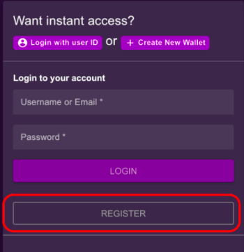
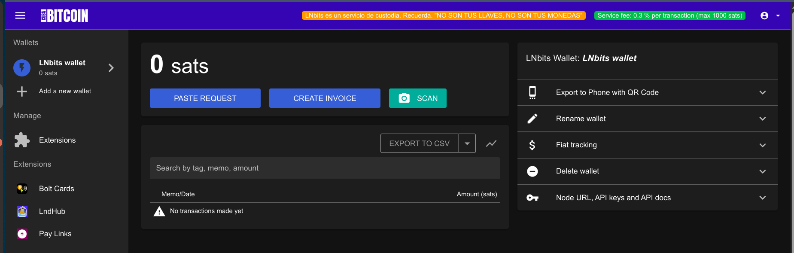
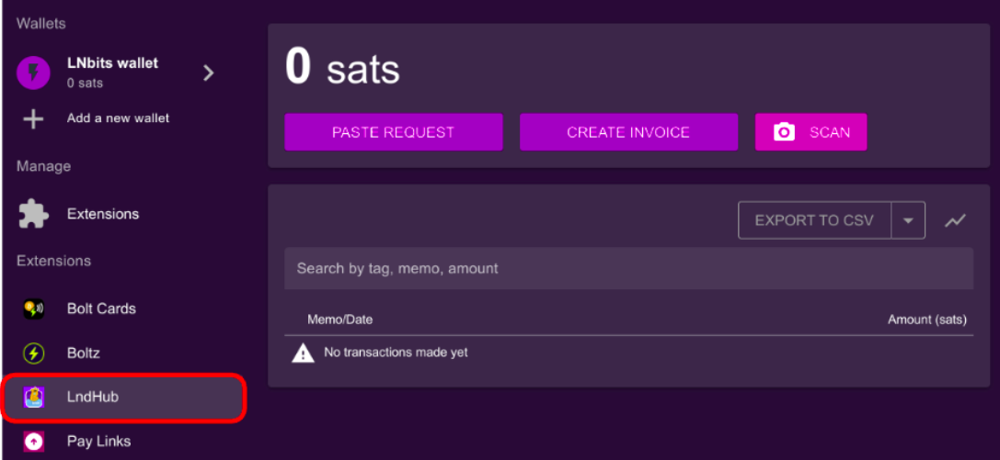
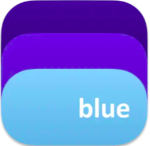
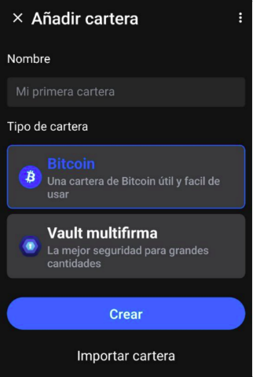
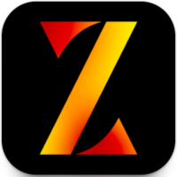
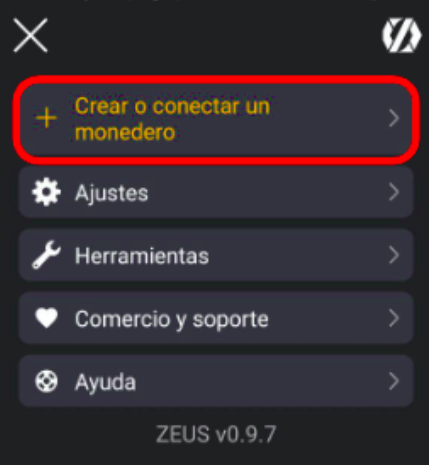
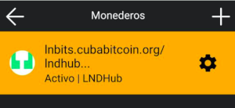
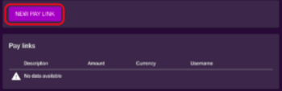

# LNbits en Cuba Bitcoin

1. [Introducción](#1-introducción)  
1.1. [¿Qué es LNbits?](#11-qué-es-lnbits)  
1.2. [Breve resumen sobre la iniciativa de la comunidad Cuba Bitcoin](#12-breve-resumen-sobre-la-iniciativa-de-la-comunidad-cuba-bitcoin)  
2. [¿Cómo crear una cuenta en LNbits?](#2-cómo-crear-una-cuenta-en-lnbits)  
2.1 [Interfaz LNbits](#21-interfaz-en-lnbits)  
3. [Exportar acceso a la cuenta desde BlueWallet y Zeus](#3-exportar-acceso-a-la-cuenta-desde-blue-wallet-y-zeus-wallet)  
3.1 [¿Por qué usar una app móvil para gestionar tu cuenta?](#31-por-qué-usar-una-app-móvil-para-gestionar-tu-cuenta)  
3.2 [Accediendo a LNHUB](#32-accediendo-a-lndhub)  
3.3 [Integración con BlueWallet](#33-integración-con-bluewallet)  
3.4 [Integración con Zeus](#34-integración-con-zeus-wallet)  
4. [Crear tu propia LN Address desde el servidor](#4-crear-tu-propia-ln-address-desde-el-servidor)  
4.1 [¿Qué es una LN Address?](#41-qué-es-una-ln-address)  
4.2 [Configuración en LNbits](#42-configuración-en-lnbits)  
5. [Accediendo al servidor desde Cuba](#5-accediendo-al-servicio-desde-cuba)  
5.1 [¿Existen restricciones de acceso?](#51-existen-restricciones-de-acceso)  
5.2 [¿Es necesario usar VPN o Tor?](#52-es-necesario-usar-vpn-o-tor)  
6. [¿Cómo puedes ayudar a la comunidad?](#6-cómo-puedes-ayudar-a-la-comunidad)  
6.1 [Donaciones para sostener el servidor](#61-donaciones-para-sostener-el-servicio)  
6.2 [Reporte de errores y mejoras en la plataforma](#62-reporte-de-errores-y-sugerencias-de-mejora-en-la-plataforma)  
6.3 [Participación en la educación y difusión sobre Bitcoin en Cuba](#63-participación-en-la-educación-y-difusión-sobre-bitcoin-en-cuba)  
7. [Conclusión](#7-conclusión)  
7.1 [Próximos pasos y cómo LNbits puede seguir evolucionando en la comunidad](#71-próximos-pasos-y-cómo-lnbits-puede-seguir-evolucionando-en-la-comunidad)  
7.2 [Importancia de la autocustodia](#72-importancia-de-la-autocustodia)  

## 1 Introducción
### 1.1 ¿Qué es LNbits?

LNbits es un sistema de gestión de billeteras y herramientas para Lightning Network, diseñado para ofrecer una interfaz fácil de usar y altamente modular. Permite a cualquier persona crear y administrar múltiples billeteras de Bitcoin sobre Lightning, sin necesidad de configurar un nodo completo. Gracias a su flexibilidad y extensibilidad, LNbits facilita la adopción de Bitcoin al permitir la integración con diferentes aplicaciones y servicios financieros descentralizados.

Su importancia radica en que democratiza el acceso a Lightning Network, brindando una forma sencilla de manejar pagos instantáneos sin fricciones, con soporte para múltiples usuarios y diversas extensiones. Además, al ser software de código abierto, permite a cualquier comunidad desplegar su propia instancia y personalizarla según sus necesidades.

### 1.2 Breve resumen sobre la iniciativa de la comunidad Cuba Bitcoin

La comunidad Cuba Bitcoin ha tenido que enfrentarse a constantes barreras en su camino hacia la adopción de Bitcoin. Múltiples herramientas y servicios se ven restringidos debido a las sanciones impuestas al pueblo cubano ([Más información aquí](https://github.com/cuban-opensourcers/cuban-restricted)), lo que dificulta el acceso a la tecnología. Además, muchas plataformas requieren procesos KYC, y debido a las sanciones de la OFAC y las fuertes restricciones económicas, los cubanos son constantemente excluidos del sistema financiero internacional.

En el ámbito de Bitcoin, varias billeteras han bloqueado directa o indirectamente a los usuarios cubanos. Algunas, como [Blink Wallet](https://es.blink.sv/), los prohíben explícitamente. Otras, como [Green Wallet](https://blockstream.com/green/) y [Aqua Wallet](https://aqua.net/), no los bloquean directamente, pero requieren el uso de VPN dentro de Cuba para poder acceder a sus servicios.

En un esfuerzo por fomentar el uso de Bitcoin y la soberanía financiera en la isla, la comunidad Cuba Bitcoin ha lanzado su propio servidor LNbits, operando sobre su propio nodo de Lightning Network:

- [**LNbits Cuba Bitcoin**](https://lnbits.cubabitcoin.org/)  
- [**Nodo de Cuba Bitcoin desde Mempool Space**](https://mempool.space/es/lightning/node/03736eabf99d772903d72bfc8b2e9792e9f408f3c0456a05267737fec607a9d3e4)
- [**Nodo de Cuba Bitcoin desde Amboss Space**](https://amboss.space/es/node/03736eabf99d772903d72bfc8b2e9792e9f408f3c0456a05267737fec607a9d3e4)

Esta iniciativa busca proporcionar a los cubanos una herramienta accesible para administrar sus fondos en Lightning sin depender de servicios extranjeros. Cuba Bitcoin siempre ha apostado por soluciones de auto custodia siguiendo el principio maximalista:

> “No tus llaves, no tus monedas”

Sin embargo, estas soluciones pueden crear una fricción inicial para nuevos usuarios, debido principalmente a la poca capacidad de fondos para poder abrir canales y pagar comisiones de red, que en ocasiones pueden ser altas para el salario promedio en Cuba (menos de 15 USD al mes), permitiendo menores comisiones para transferencias hacia nodos externos en comparación con los servicios más populares y comisiones de costo 0 para pagos de facturas dentro del mismo nodo.

Con este servicio, la comunidad busca reducir estas barreras, permitiendo a más personas experimentar con Lightning Network y acceder a pagos instantáneos.

## 2 ¿Cómo crear una cuenta en LNbits?

1. Dirígete a: [https://lnbits.cubabitcoin.org/](https://lnbits.cubabitcoin.org/)

2. Haz clic en la opción **REGISTER** para crear una nueva cuenta.

3. Completa los campos necesarios. Para este ejemplo, usaremos el nombre **Alice**.

4. Haz clic en **CREATE ACCOUNT** para finalizar el registro.

5. ¡Listo! Ya tienes tu cuenta creada en el LNbits de Cuba Bitcoin.

### 2.1 Interfaz en LNbits

Vamos a desglosar las partes visibles de la interfaz de LNbits:

**1. Menú izquierdo superior**

Aquí se encuentran las opciones principales de gestión de la billetera:

**Wallets:**
- **"LNbits wallet"** → Es la billetera activa (se pueden tener varias).
- **"Add a new wallet"** → Permite crear nuevas billeteras dentro del mismo usuario.

**2. Menú izquierdo inferior**

Aquí se encuentran las opciones principales de gestión de la billetera:

**Manage:**
- **"Extensions"** → Sección donde se pueden habilitar extensiones adicionales para mejorar las funcionalidades de LNbits.

**Extensions (Extensiones habilitadas en este servidor):**
- **Bolt Cards:** Para administrar tarjetas NFC Lightning.
- **Boltz:** Permite intercambios atómicos entre Bitcoin on-chain y Lightning.
- **LndHub:** Permite que la billetera funcione como un servidor de custodia.
- **Pay Links:** Crea enlaces de pago para recibir donaciones o pagos con Lightning.

**3. Panel principal (centro)**

Aquí se muestra el estado de la billetera activa:

**Saldo:**  
Se muestra como `"0 sats"`, indicando que no hay fondos en la billetera.

**Botones de acción:**
- **"PASTE REQUEST"** → Para pegar una solicitud de pago o factura Lightning.
- **"CREATE INVOICE"** → Generar una factura para recibir pagos.
- **"SCAN"** → Escanear un código QR con una solicitud de pago.

**Historial de transacciones:**  
Actualmente muestra `"No transactions made yet"`, lo que indica que aún no se han realizado transacciones.

**Exportación de datos:**
- **"EXPORT TO CSV"** → Opción para descargar el historial de transacciones en formato CSV.

**4. Panel derecho (opciones avanzadas de la billetera)**

Opciones para gestionar la billetera en uso:

- **"Export to Phone with QR Code"** → Permite exportar la billetera a una aplicación móvil mediante un código QR.
- **"Rename wallet"** → Posibilidad de cambiar el nombre de la billetera.
- **"Fiat tracking"** → Activar o desactivar el seguimiento del saldo en moneda fiduciaria.
- **"Delete wallet"** → Opción para eliminar la billetera (con precaución).
- **"Node URL, API keys and API docs"** → Muestra la URL del nodo, claves API y documentación para desarrolladores.

## 3. Exportar acceso a la cuenta desde Blue Wallet y Zeus Wallet

### 3.1 ¿Por qué usar una app móvil para gestionar tu cuenta?

Usar una app móvil para gestionar tu cuenta en LNbits tiene muchas ventajas. Te permite acceder a tu billetera en cualquier momento y desde cualquier lugar, sin depender de una computadora. Además, la interfaz móvil es más sencilla y rápida para hacer transacciones diarias.

En Lightning Network, la mayoría de los pagos se hacen escaneando códigos QR, lo que significa que con una app móvil puedes generar y pagar facturas en segundos. También puedes habilitar tu **LN Address**, facilitando recibir pagos sin necesidad de crear facturas manualmente.

En cuanto a seguridad, exportar tu cuenta a una app móvil ayuda a reducir el riesgo de ataques de *phishing* o *malware* en navegadores, dándote más control y tranquilidad sobre tus fondos.

### 3.2 Accediendo a LNDHub

En el menú izquierdo inferior accedemos a la extensión **LndHub**:

Esta nos muestra dos opciones:
- **LNDHUB INVOICE**: Nos permite recibir nuestros bitcoins o satoshis en una billetera, pero no nos permite transferirlos (ideal para dueños de negocios).
- **LNDHUB ADMIN**: Nos permite recibir y enviar nuestros sats.

Si poseemos más de una wallet, la seleccionamos en la opción **Select Wallet**.

### 3.3 Integración con BlueWallet

Accedemos a [**BlueWallet**](https://bluewallet.io/):

- [Apple Store](https://apps.apple.com/us/app/bluewallet-bitcoin-wallet/id1376878040)
- [Google Play](https://play.google.com/store/apps/details?id=io.bluewallet.bluewallet)

1. En la opción **Añadir cartera**, seleccionamos **Añadir**.

2. Seleccionamos la opción **Importar cartera**.

3. Escaneamos el **LNDHUB INVOICE** o el **LNDHUB ADMIN**, de acuerdo al uso que le vayamos a dar… ¡y listo!

### 3.4 Integración con Zeus Wallet

Accedemos a [**Zeus Wallet**](https://zeusln.com/):

- [Apple Store](https://apps.apple.com/us/app/zeus-wallet/id1456038895)
- [Google Play](https://play.google.com/store/apps/details?id=app.zeusln.zeus)
- [Descarga directa](https://zeusln.com/zeus-v0.9.7-universal.apk)

1. Seleccionamos **CONFIGURACIÓN AVANZADA**.

2. Luego, seleccionamos **Crear o conectar un monedero**.

3. En la parte superior derecha, tocamos el ícono de escanear (un pequeño cuadro) y escaneamos el **LNDHUB INVOICE** o el **LNDHUB ADMIN**, de acuerdo al uso que le vayamos a dar.

4. Una vez escaneado, seleccionamos **GUARDAR CONFIGURACIÓN DEL MONEDERO**.

¡Listo! Ya tenemos nuestra cuenta de **LNbits** cargada en **Zeus Wallet**.

## 4. Crear tu propia LN Address desde el servidor

### 4.1 ¿Qué es una LN Address?

Una **LN Address** (dirección Lightning Network) es una dirección única que permite recibir pagos a través de la **Lightning Network (LN)**. Es como un número de cuenta en una red de pagos rápida y económica, que funciona encima de la red principal de **Bitcoin**. 

A diferencia de las direcciones tradicionales de **Bitcoin**, que son largas y difíciles de recordar, una **LN Address** es mucho más fácil de usar y se parece a una dirección de correo electrónico (por ejemplo, `usuario@dominio.com`).

### 4.2 Configuración en LNbits

1. En la ventana de **Extensions**, seleccionamos **Pay Links**.

2. Seleccionamos **New Pay Link**.

3. Llenamos los campos básicos:
   - En **Wallet**, seleccionamos la billetera a utilizar.
   - En **Item description**, ponemos la descripción de la LN Address (ejemplo: **Personal account**).
   - En **Lightning Address**, elegimos el nick que usaremos.
   - **Min**: La cantidad mínima de satoshis a aceptar.
   - **Max**: La cantidad máxima de satoshis a aceptar.

4. **Configuración avanzada**:
   - En **LNURL**, ponemos un número (recomendamos **300**, que es la cantidad máxima de caracteres que aceptaremos cuando las personas deseen enviarnos un mensaje enviando sats).
   - También podemos habilitar **Zaps en Nostr** marcando la opción **Enable nostr zaps**.

5. Luego, terminamos de crear nuestro link en la opción **CREATE PAY LINK**, obteniendo una dirección como, por ejemplo, **alice@lnbits.cubabitcoin.org**.

Podemos modificar en cualquier momento la configuración de nuestra **LN Address** o eliminarla.

## 5. Accediendo al servicio desde Cuba

### 5.1 ¿Existen restricciones de acceso?

En **Cuba**, el acceso a servicios internacionales puede verse afectado por limitaciones en la infraestructura de internet. Sin embargo, este servicio se crea como una alternativa más para poder cobrar, gastar y utilizar **Bitcoin** de forma sencilla, rápida y con bajas comisiones dentro del entorno cubano.

### 5.2 ¿Es necesario usar VPN o Tor?

No es estrictamente necesario usar **VPN** o **Tor** para acceder al servidor de **LNbits de Cuba Bitcoin**, ni para acceder a **Blue Wallet** o **Zeus**. Sin embargo, el uso de **VPN** o **Tor** es una buena práctica en términos de **privacidad** y **seguridad**. En algunos casos, debido a la velocidad de internet en Cuba, puede ser necesario omitir su uso para una experiencia de usuario más fluida.

## 6. ¿Cómo puedes ayudar a la comunidad?

Puedes contribuir a la comunidad de **Cuba Bitcoin** de diversas maneras para fortalecer el uso de **Bitcoin** y **Lightning Network** en el país. A continuación, te mostramos algunas formas en las que puedes apoyar:

### 6.1 Donaciones para sostener el servicio:

El mantenimiento y funcionamiento de un servidor dedicado a **LNbits** y el **Nodo de Lightning de Cuba Bitcoin** requiere recursos y tiempo constantes. Las donaciones son esenciales para asegurar que este servicio siga disponible para todos los usuarios. Con tu contribución, por pequeña que sea, podremos cubrir gastos como el mantenimiento del servidor, las actualizaciones de seguridad, los costos operativos, la apertura de nuevos canales que mejoren la experiencia del usuario, la reducción de comisiones en las transferencias y la capacidad de aceptar pagos.

Las donaciones se pueden realizar a través de **Bitcoin Lightning**. Puedes donar a:

- `cubabitcoin@lnbits.cubabitcoin.org`
- `cubabitcoin@walletofsatoshi.com`

¡Muchas gracias!

### 6.2 Reporte de errores y sugerencias de mejora en la plataforma:

Tu participación en la mejora continua de la plataforma es muy importante para nosotros. Si encuentras errores o tienes ideas para optimizar el funcionamiento de **LNbits** o el **Nodo de Lightning de Cuba Bitcoin**, no dudes en reportarlos. Tu retroalimentación nos permite corregir fallos, mejorar la experiencia del usuario y mantener la plataforma eficiente y segura.

Si cuentas con un nodo enrutador, puedes abrir canales con el [nodo de Cuba Bitcoin](https://amboss.space/es/node/03736eabf99d772903d72bfc8b2e9792e9f408f3c0456a05267737fec607a9d3e4).

Puedes enviar tus reportes de errores y sugerencias comunicándote con los administradores en el grupo de [**Telegram de Cuba Bitcoin**](https://t.me/Cuba_Bitcoin). Toda colaboración es bienvenida y contribuye a fortalecer el proyecto.

### 6.3 Participación en la educación y difusión sobre Bitcoin en Cuba:

La **educación** es el pilar fundamental de nuestra comunidad. Difundir el conocimiento sobre **Bitcoin** es clave para fomentar su adopción tanto en Cuba como en el resto del mundo.

Puedes contribuir compartiendo tus conocimientos sobre esta tecnología, organizando talleres, charlas o simplemente difundiendo información clara y precisa sobre su funcionamiento. Al hacerlo, ayudarás a empoderar a más personas para que aprovechen los beneficios de **Bitcoin** en su vida diaria. Si deseas organizar un taller, meetup o clase en tu comunidad, puedes contar con el apoyo y la experiencia de la comunidad **Cuba Bitcoin**.

Además, puedes colaborar creando contenido educativo, compartiendo recursos o participando en actividades comunitarias. Síguenos en nuestras redes sociales y apóyanos con un "like" o un "retweet". Tu apoyo ayuda a que nuestro trabajo educativo llegue a más personas.

### Redes Sociales:

- **X**: [Cuba_BTC](https://twitter.com/Cuba_BTC)
- **Nostr**: 
  - **NPUB**: `npub1huyn6ru55pv6l7p0sxvlu3vfpq7pan958sl4weft0kte6lvdvvksd5s34t`
  - **NIP05**: `cubabitcoin@btcpay.cubabitcoin.org`

## 7. Conclusión

### 7.1 Próximos pasos y cómo LNbits puede seguir evolucionando en la comunidad

LNbits, como proyecto Open Source, ofrece una flexibilidad excepcional que nos permite adaptarlo a las necesidades específicas de cada contexto. Existen numerosas extensiones por explorar, muchas de las cuales podrían ser sumamente útiles para nuestra comunidad.

Un aspecto importante por revisar es el uso de puntos de venta (POS) y tarjetas NFC. Recordamos con especial interés la charla de Lukas, un bitcoiner alemán, quien en 2023, durante un meetup, nos mostró cómo estas tecnologías pueden integrarse con LNbits para facilitar aún más los pagos en Bitcoin, una opción que merece ser considerada en el futuro cercano.

Además, es crucial explorar cómo LNbits puede integrarse con plataformas de comercio electrónico construidas sobre WordPress, habilitando pagos en Bitcoin de manera sencilla y eficiente. La posibilidad de conectar tiendas en línea con LNbits abriría un nuevo abanico de oportunidades para el comercio basado en Bitcoin.

Las posibilidades son infinitas, y cada día surgen nuevas formas de mejorar la plataforma y expandir su uso.  
**Te invitamos a unirte a nosotros en el proceso de descubrir y potenciar todas las capacidades que LNbits tiene para ofrecer.**

### 7.2 Importancia de la autocustodia

Aunque este servicio facilita la integración de nuevos usuarios y es una excelente manera de comenzar a interactuar con Bitcoin, es fundamental no considerarlo como la solución definitiva. Bitcoin, tal como lo definió Satoshi Nakamoto en su *White Paper*, es un sistema *peer-to-peer*, sin intermediarios.

Al depender de servicios custodiales, corremos el riesgo de confiar en terceros, lo cual entraña ciertos peligros, como la pérdida de fondos o la vulnerabilidad ante ataques externos.

La verdadera solución, siempre que sea posible, está en alcanzar la soberanía financiera mediante la autocustodia de nuestros fondos.  
**Utiliza el LNbits de Cuba Bitcoin sabiamente.**

Cuando hayas acumulado suficientes fondos para abrir un canal de Lightning, te recomendamos abrirlo hacia el nodo de Cuba Bitcoin o hacia cualquier otro nodo de tu elección. Además, si tienes los recursos, el conocimiento y la infraestructura necesaria, considera crear tu propio nodo. De ser necesario, la comunidad estará dispuesta a ayudarte en este proceso.

**El objetivo debe ser siempre: ser dueño de tu propio dinero.**  
Este servicio solo es un trampolín para alcanzar esa meta.

---

**Autor: Forte11**

- Sígueme en X : [https://x.com/Forte11Cuba](https://x.com/Forte11Cuba)
- Sígueme en Nostr:
  - npub: `npub1f0rtesc8yd8utjhpgktlltv4t2rftxd5kmkagt5kymt8946pqf7qe90snx`
  - NIP05: `forte11@cubabitcoin.org`

☕ **Regálame un cafecito con Lightning Network:**  
`forte11@lnbits.cubabitcoin.org`

